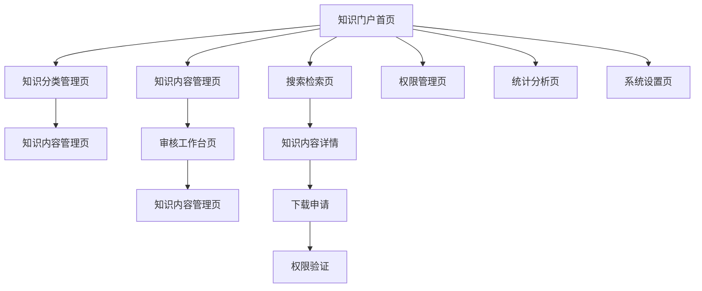
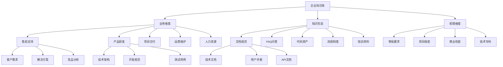
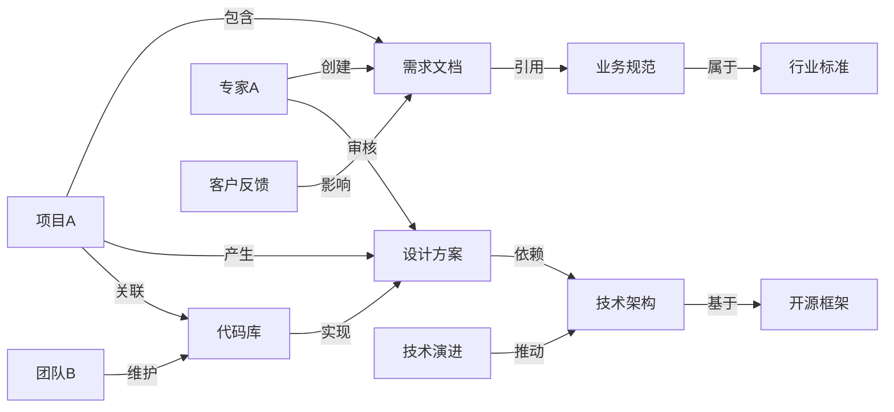
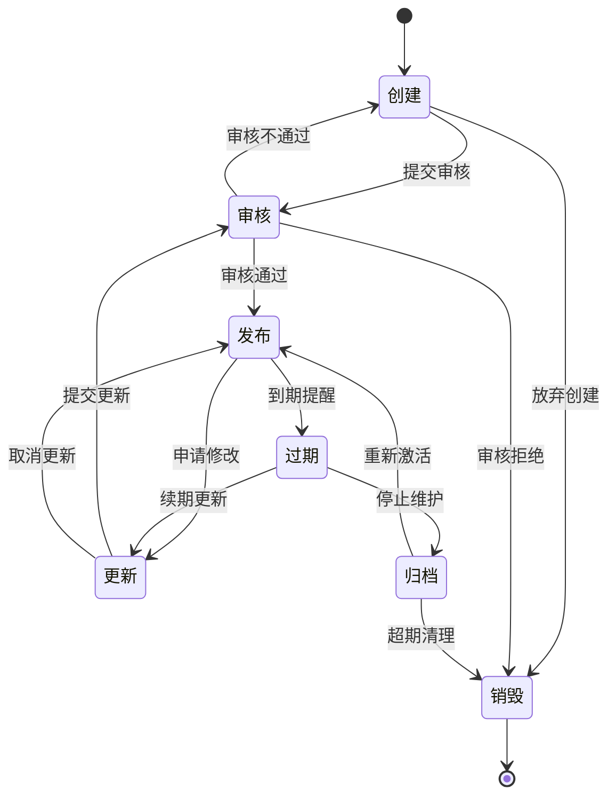
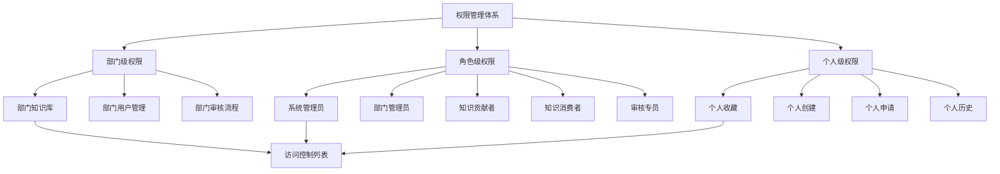
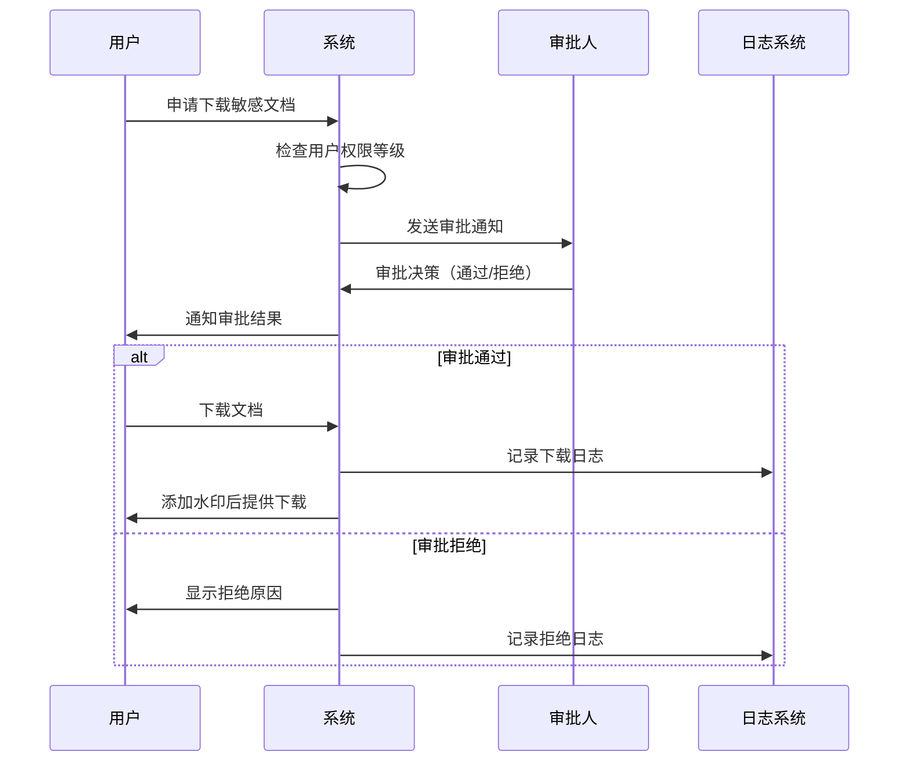
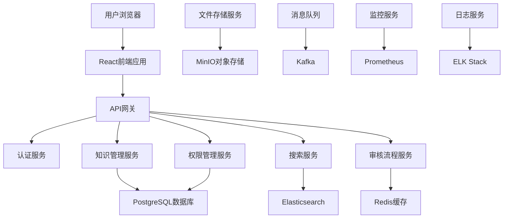
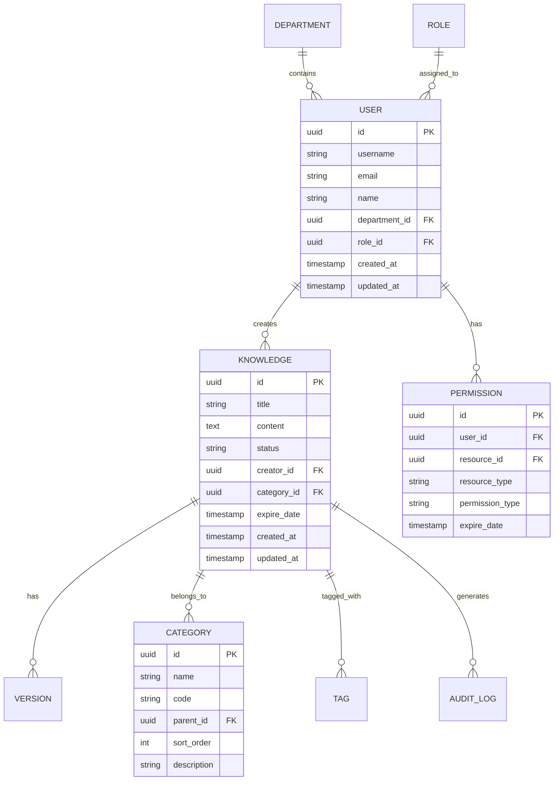

# 企业级知识库管理规范

## 1. 产品概述

企业级知识库管理系统是一个面向企业内部的知识资产管理平台，旨在实现知识的系统化存储、分类、检索和共享。系统支持多维度知识分类、全生命周期管理和精细化权限控制，帮助企业构建高效的知识管理体系，提升组织学习能力和业务协同效率。

## 2. 核心功能

### 2.1 用户角色

| 角色    | 注册方式    | 核心权限                      |
| ----- | ------- | ------------------------- |
| 系统管理员 | 系统预设账号  | 全系统管理权限，包括用户管理、权限配置、系统设置等 |
| 部门管理员 | 上级管理员指定 | 部门内知识库管理、用户权限分配、审核流程管理    |
| 知识贡献者 | 部门管理员审批 | 创建、编辑知识内容，提交审核申请          |
| 知识消费者 | 自助注册+审批 | 浏览、搜索、下载已授权的知识内容          |
| 审核专员  | 部门管理员指定 | 知识内容审核、质量把控、发布管理          |

### 2.2 功能模块

我们的企业级知识库管理规范包含以下主要页面：

1. **知识门户首页**：知识导航、热门内容、个人工作台、统计仪表板
2. **知识分类管理页**：双树模型管理、标签体系维护、分类规则配置
3. **知识内容管理页**：内容创建编辑、版本管理、生命周期状态跟踪
4. **权限管理页**：用户权限配置、角色管理、访问控制策略
5. **审核工作台页**：待审核列表、审核流程管理、质量评估
6. **搜索检索页**：全文搜索、智能推荐、知识图谱导航
7. **统计分析页**：使用统计、知识价值分析、运营报表
8. **系统设置页**：基础配置、安全策略、集成管理

### 2.3 页面详情

| 页面名称    | 模块名称   | 功能描述                     |
| ------- | ------ | ------------------------ |
| 知识门户首页  | 导航面板   | 展示知识分类树、快速导航、个性化推荐       |
| 知识门户首页  | 工作台    | 显示个人待办、最近访问、收藏内容、消息通知    |
| 知识门户首页  | 统计仪表板  | 展示知识库概况、访问统计、热门内容排行      |
| 知识分类管理页 | 主题标签树  | 管理业务导向的分类体系，支持多级分类和标签关联  |
| 知识分类管理页 | 知识图谱   | 维护知识实体关系，支持关联关系可视化展示     |
| 知识内容管理页 | 内容编辑器  | 支持富文本、Markdown、附件上传、版本控制 |
| 知识内容管理页 | 生命周期管理 | 跟踪内容状态变更、设置有效期、自动归档提醒    |
| 权限管理页   | 用户管理   | 用户账号管理、角色分配、部门组织架构维护     |
| 权限管理页   | 访问控制   | 配置三级权限策略、敏感内容保护、动态水印设置   |
| 审核工作台页  | 审核流程   | 处理内容审核申请、质量评估、发布决策       |
| 审核工作台页  | 质量管控   | 内容质量评分、标准化检查、改进建议        |
| 搜索检索页   | 智能搜索   | 全文检索、语义搜索、多维度筛选、结果排序     |
| 搜索检索页   | 知识推荐   | 基于用户行为的个性化推荐、相关内容关联      |
| 统计分析页   | 使用分析   | 访问统计、用户行为分析、内容热度分析       |
| 统计分析页   | 价值评估   | 知识资产价值评估、ROI分析、效益报告      |
| 系统设置页   | 基础配置   | 系统参数设置、业务规则配置、集成接口管理     |
| 系统设置页   | 安全管理   | 安全策略配置、审计日志、合规性检查        |

## 3. 核心流程

### 3.1 知识管理员流程

知识管理员负责整体知识库的规划和管理：登录系统 → 配置分类体系 → 设置权限策略 → 监控系统运行 → 分析使用数据 → 优化管理策略

### 3.2 知识贡献者流程

知识贡献者创建和维护知识内容：登录系统 → 选择知识分类 → 创建/编辑内容 → 提交审核 → 跟踪审核状态 → 发布后维护更新

### 3.3 知识消费者流程

知识消费者查找和使用知识：登录系统 → 浏览/搜索知识 → 申请访问权限 → 查看内容详情 → 下载/收藏 → 反馈评价

### 3.4 审核专员流程

审核专员负责内容质量把控：登录系统 → 查看待审核列表 → 审核内容质量 → 提出修改建议 → 审批发布 → 跟踪发布效果

## 4. 用户界面设计

### 4.1 设计风格

* **主色调**：企业蓝 (#1890FF)，辅助色：浅灰 (#F5F5F5)，强调色：橙色 (#FF7D00)

* **按钮样式**：圆角矩形，主按钮采用渐变效果，次要按钮为线框样式

* **字体**：中文使用微软雅黑，英文使用 Roboto，标题 16-20px，正文 14px，说明文字 12px

* **布局风格**：卡片式布局，左侧导航 + 主内容区域，响应式设计

* **图标风格**：线性图标风格，统一使用 Ant Design 图标库，支持主题色适配

### 4.2 页面设计概览

| 页面名称    | 模块名称   | UI元素                       |
| ------- | ------ | -------------------------- |
| 知识门户首页  | 导航面板   | 左侧树形导航，支持折叠展开，图标+文字形式，悬停效果 |
| 知识门户首页  | 工作台    | 卡片式布局，4列网格，图标+数字+标题，点击跳转   |
| 知识门户首页  | 统计仪表板  | 图表组件，柱状图+饼图+趋势线，实时数据更新     |
| 知识分类管理页 | 主题标签树  | 可拖拽树形结构，右键菜单，批量操作工具栏       |
| 知识分类管理页 | 知识图谱   | 力导向图可视化，节点可点击，关系线条标注       |
| 知识内容管理页 | 内容编辑器  | 富文本编辑器，工具栏浮动，预览模式切换        |
| 知识内容管理页 | 生命周期管理 | 时间轴展示，状态标签，进度条指示器          |
| 权限管理页   | 用户管理   | 表格+筛选器，批量操作，模态框编辑          |
| 权限管理页   | 访问控制   | 权限矩阵表格，开关组件，级联选择器          |
| 审核工作台页  | 审核流程   | 看板式布局，拖拽操作，状态流转动画          |
| 搜索检索页   | 智能搜索   | 搜索框+高级筛选，结果列表+分页，相关度排序     |
| 统计分析页   | 使用分析   | 仪表板布局，多种图表类型，时间范围选择器       |
| 系统设置页   | 基础配置   | 表单布局，分组折叠面板，实时保存提示         |

### 4.3 响应式设计

系统采用桌面优先的响应式设计，支持1920px、1366px、1024px等主流分辨率。移动端采用适配性布局，优化触摸交互体验，支持手势操作和移动端特有功能。

## 5. 双树模型信息架构

### 5.1 主题标签树（业务导向）

### 5.2 知识图谱（关系导向）

## 6. 文档生命周期管理

### 6.1 生命周期阶段定义

| 阶段 | 状态描述       | 操作权限   | 自动触发条件  |
| -- | ---------- | ------ | ------- |
| 创建 | 草稿状态，内容编辑中 | 创建者可编辑 | 用户新建内容  |
| 审核 | 提交审核，等待审批  | 审核员可审批 | 创建者提交审核 |
| 发布 | 正式发布，用户可访问 | 只读状态   | 审核通过后发布 |
| 更新 | 内容更新，重新审核  | 创建者可编辑 | 用户申请修改  |
| 过期 | 超过有效期，需要更新 | 提醒更新   | 到达设定有效期 |
| 归档 | 历史版本，只读保存  | 管理员可操作 | 新版本发布后  |
| 销毁 | 彻底删除，不可恢复  | 系统管理员  | 超过保留期限  |

### 6.2 生命周期流程图

### 6.3 自动化管理策略

* **有效期管理**：根据内容类型设置默认有效期（技术文档1年，流程制度2年，FAQ半年）

* **到期提醒**：提前30天、7天、1天发送邮件和系统通知

* **自动归档**：过期30天后自动转为归档状态

* **定期清理**：归档满2年的内容进入销毁流程

* **版本控制**：保留最近5个版本，自动压缩历史版本

## 7. 权限管理体系

### 7.1 三级权限架构

### 7.2 权限控制矩阵

| 操作类型 | 系统管理员 | 部门管理员  | 知识贡献者   | 知识消费者  | 审核专员   |
| ---- | ----- | ------ | ------- | ------ | ------ |
| 创建内容 | ✓     | ✓      | ✓       | ✗      | ✓      |
| 编辑内容 | ✓     | ✓(部门内) | ✓(自己创建) | ✗      | ✗      |
| 删除内容 | ✓     | ✓(部门内) | ✓(草稿状态) | ✗      | ✗      |
| 审核内容 | ✓     | ✓(部门内) | ✗       | ✗      | ✓      |
| 发布内容 | ✓     | ✓(部门内) | ✗       | ✗      | ✓      |
| 查看内容 | ✓     | ✓(已授权) | ✓(已授权)  | ✓(已授权) | ✓(已授权) |
| 下载内容 | ✓     | ✓(已授权) | ✓(已授权)  | ✓(需审批) | ✓(已授权) |
| 用户管理 | ✓     | ✓(部门内) | ✗       | ✗      | ✗      |
| 权限配置 | ✓     | ✓(部门内) | ✗       | ✗      | ✗      |
| 系统设置 | ✓     | ✗      | ✗       | ✗      | ✗      |

### 7.3 敏感内容保护机制

#### 7.3.1 动态水印系统

* **文档水印**：自动在PDF、Word文档中添加用户信息、时间戳、IP地址

* **图片水印**：在图片右下角添加半透明用户标识

* **页面水印**：网页浏览时显示用户信息背景水印

* **水印算法**：采用不可见水印技术，防止恶意去除

#### 7.3.2 下载审批流程

#### 7.3.3 有效期控制

* **临时授权**：敏感内容访问权限设置时效性（1天、3天、7天、30天）

* **自动回收**：权限到期后自动撤销访问权限

* **续期申请**：用户可申请延长访问期限，需重新审批

* **紧急撤销**：管理员可随时撤销已授权的访问权限

## 8. 技术架构设计

### 8.1 系统架构图

### 8.2 核心技术栈

* **前端**：React 18 + TypeScript + Ant Design + Vite

* **后端**：Spring Cloud + Java 17 + Spring Security

* **数据库**：PostgreSQL 14 + Redis 7

* **搜索引擎**：Elasticsearch 8

* **文件存储**：MinIO

* **消息队列**：Apache Kafka

* **容器化**：Docker + Kubernetes

* **监控**：Prometheus + Grafana

* **日志**：ELK Stack

### 8.3 数据模型设计

## 9. 最佳实践建议

### 9.1 内容质量管控

1. **标准化模板**：为不同类型的知识内容提供标准化模板
2. **质量评分**：建立内容质量评分机制，包括完整性、准确性、实用性
3. **专家评审**：重要内容需要领域专家参与评审
4. **用户反馈**：建立用户评价和反馈机制，持续改进内容质量
5. **定期审查**：建立定期内容审查机制，及时更新过时信息

### 9.2 知识运营策略

1. **激励机制**：建立知识贡献积分制度，定期表彰优秀贡献者
2. **培训推广**：定期组织知识管理培训，提升全员知识意识
3. **使用分析**：通过数据分析识别热门内容和知识缺口
4. **社区建设**：建立知识分享社区，促进经验交流
5. **外部引入**：适当引入外部优质知识资源，丰富知识库内容

### 9.3 安全合规建议

1. **数据分类**：建立数据分类分级制度，明确不同级别的保护要求
2. **访问审计**：完整记录所有访问行为，支持合规审计
3. **备份策略**：建立多层次备份机制，确保数据安全
4. **应急预案**：制定数据泄露应急响应预案
5. **合规检查**：定期进行安全合规检查，及时发现和修复风险

### 9.4 系统优化建议

1. **性能优化**：采用CDN加速、缓存策略、数据库优化等技术手段
2. **用户体验**：持续优化界面设计和交互流程
3. **移动适配**：提供移动端应用，支持随时随地访问
4. **智能化**：引入AI技术，提供智能推荐、自动分类等功能
5. **集成扩展**：与企业现有系统集成，提供统一的知识服务

## 10. 实施路线图

### 10.1 第一阶段（1-3个月）：基础平台建设

* 完成基础架构搭建

* 实现用户管理和权限控制

* 开发内容管理核心功能

* 建立基本的审核流程

### 10.2 第二阶段（4-6个月）：功能完善

* 实现双树模型信息架构

* 完善生命周期管理

* 开发搜索和推荐功能

* 集成安全保护机制

### 10.3 第三阶段（7-9个月）：优化提升

* 完善统计分析功能

* 优化用户体验

* 加强系统性能

* 开展用户培训

### 10.4 第四阶段（10-12个月）：推广应用

* 全面推广使用

* 收集用户反馈

* 持续优化改进

* 建立运营体系

***

*本规范文档版本：v0.5*\
*最后更新时间：2025年9月*\
*文档作者：伍志勇*
