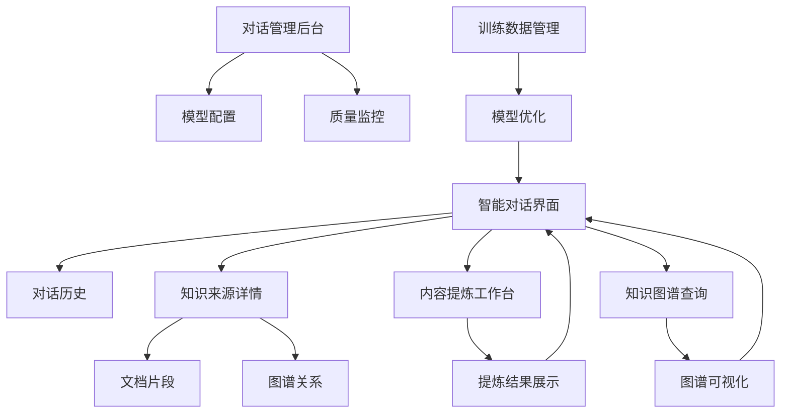
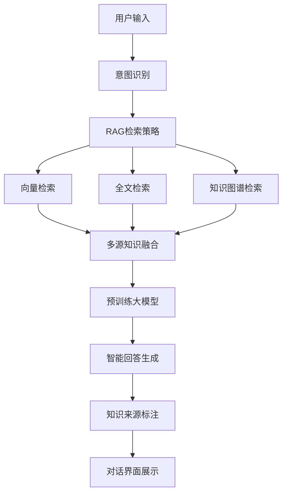
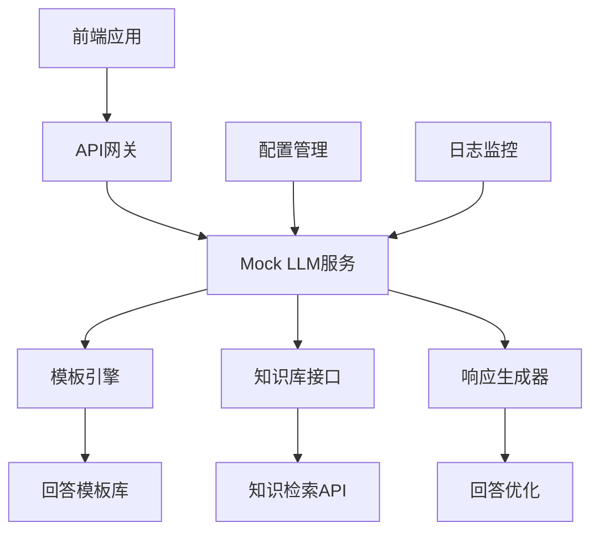
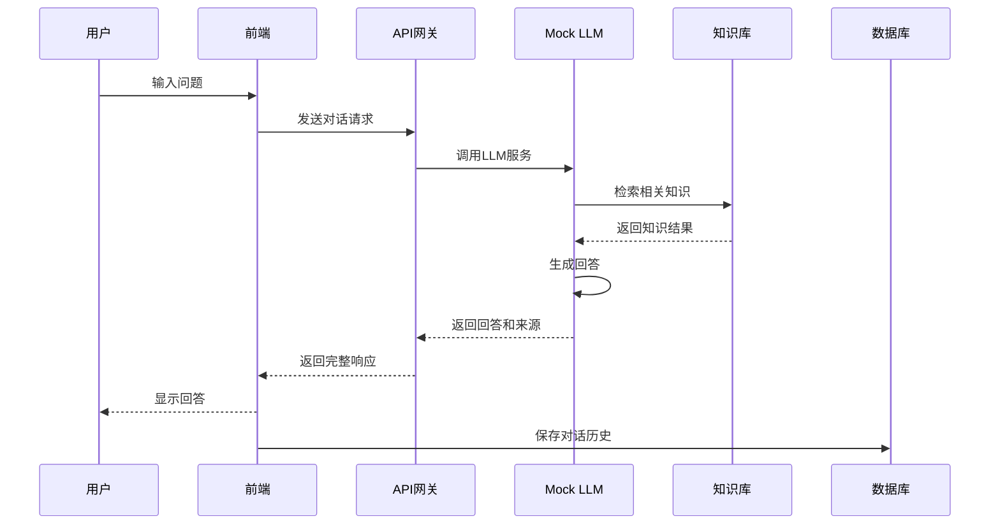
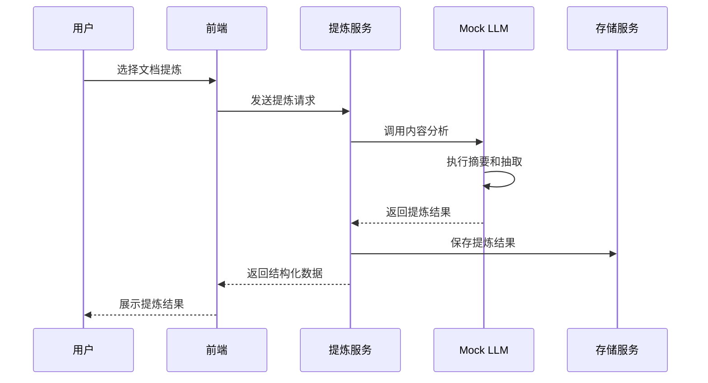

# 智能对话功能模块产品需求文档

## 1. 产品概述

智能对话功能模块是企业级知识库管理系统的核心扩展组件，通过集成垂直领域预训练大模型，为用户提供自然语言交互的知识检索和问答服务。系统支持连续对话、智能知识检索、内容提炼和知识图谱查询，显著提升知识获取效率和用户体验。

该模块旨在解决传统关键词搜索的局限性，通过AI驱动的对话式交互，帮助用户更精准地获取所需知识，并提供智能化的内容分析和提炼服务。

## 2. 核心功能

### 2.1 用户角色

| 角色 | 注册方式 | 核心权限 |
|------|----------|----------|
| 知识对话用户 | 继承现有用户角色 | 可使用智能对话功能，根据原有权限访问对应知识内容 |
| 对话管理员 | 系统管理员指定 | 管理对话配置、监控对话质量、调整AI模型参数 |
| 知识训练师 | 部门管理员指定 | 优化领域知识训练数据、调整模型回答质量 |

### 2.2 功能模块

我们的智能对话功能模块包含以下主要页面：

1. **智能对话界面**：对话窗口、历史记录、知识来源展示、对话设置、集成检索功能
2. **内容提炼工作台**：文档摘要、关键信息提取、结构化展示、导出功能
3. **知识图谱查询页面**：图谱可视化、关系探索、路径查询、节点详情
4. **对话管理后台**：模型配置、对话监控、质量评估、数据分析
5. **训练数据管理页面**：样本管理、标注工具、模型训练、效果评估

### 2.3 页面详情

| 页面名称 | 模块名称 | 功能描述 |
|----------|----------|----------|
| 智能对话界面 | 对话窗口 | 支持文本输入、语音输入、多轮对话、上下文理解 |
| 智能对话界面 | 历史记录 | 保存对话历史、快速检索、收藏重要对话、分享对话 |
| 智能对话界面 | 知识来源 | 显示答案来源文档、置信度评分、相关度排序，包含文档片段和图谱关系 |
| 智能对话界面 | 集成检索功能 | 在对话过程中自动执行向量检索、全文检索和知识图谱检索，无需用户手动操作 |
| 内容提炼工作台 | 文档摘要 | 自动生成摘要、关键词提取、主题识别、情感分析 |
| 内容提炼工作台 | 结构化提取 | 提取实体信息、关系抽取、表格生成、知识点整理 |
| 知识图谱查询页面 | 图谱可视化 | 交互式图谱展示、节点筛选、关系高亮、布局调整 |
| 知识图谱查询页面 | 路径查询 | 实体间路径查找、最短路径、关系链分析、推理查询 |
| 对话管理后台 | 模型配置 | 模型参数调整、提示词管理、回答模板、质量阈值 |
| 对话管理后台 | 质量监控 | 对话质量评估、用户满意度、错误分析、改进建议 |
| 训练数据管理页面 | 样本管理 | 训练样本收集、数据清洗、质量检查、版本管理 |
| 训练数据管理页面 | 模型训练 | 模型微调、效果评估、A/B测试、版本发布 |

## 3. 核心流程

### 3.1 智能对话流程

用户通过自然语言与系统对话：进入对话界面 → 输入问题或需求 → 系统理解意图 → AI通过RAG架构并行执行向量检索、全文检索和知识图谱检索 → 融合多源知识后生成回答 → 展示知识来源 → 用户反馈评价 → 持续优化

### 3.2 内容提炼流程

 AI辅助内容分析提炼：选择目标文档 → 设置提炼参数 → AI分析处理 → 生成结构化结果 → 人工审核确认 → 保存或导出

### 3.3 知识图谱查询流程

图谱化知识探索：输入查询实体 → 图谱检索匹配 → 可视化展示 → 交互式探索 → 关系分析 → 路径查询 → 结果导出



## 4. 用户界面设计

### 4.1 设计风格

* **主色调**：智能蓝 (#1677FF)，辅助色：科技灰 (#F0F2F5)，强调色：AI绿 (#52C41A)
* **按钮样式**：现代化圆角设计，对话按钮采用渐变效果，AI功能按钮带有科技感光效
* **字体**：中文使用苹方/微软雅黑，英文使用 Inter，对话内容 15px，界面文字 14px，提示文字 12px
* **布局风格**：对话式布局，左右气泡设计，卡片式信息展示，响应式适配
* **图标风格**：AI主题图标，支持动画效果，统一使用 Lucide 图标库

### 4.2 页面设计概览

| 页面名称 | 模块名称 | UI元素 |
|----------|----------|--------|
| 智能对话界面 | 对话窗口 | 聊天气泡布局，用户消息右对齐蓝色，AI回答左对齐白色，打字动画效果 |
| 智能对话界面 | 输入区域 | 多行文本框，发送按钮，语音输入按钮，附件上传，快捷指令 |
| 智能对话界面 | 侧边栏 | 历史对话列表，收藏夹，设置面板，折叠展开控制 |
| 知识检索页面 | 搜索框 | 智能搜索框，语音输入，搜索建议，历史记录下拉 |
| 知识检索页面 | 结果区域 | 卡片式结果展示，相关度评分，来源标识，快速操作按钮 |
| 内容提炼工作台 | 文档预览 | 左侧原文展示，右侧提炼结果，高亮关键信息，分段对照 |
| 内容提炼工作台 | 工具栏 | 提炼类型选择，参数设置，导出格式，批量处理 |
| 知识图谱查询页面 | 图谱画布 | 力导向布局，节点可拖拽，关系线条动画，缩放平移控制 |
| 知识图谱查询页面 | 控制面板 | 筛选器，布局算法选择，显示设置，查询历史 |
| 对话管理后台 | 仪表板 | 统计图表，实时监控，告警信息，性能指标 |
| 对话管理后台 | 配置面板 | 参数调节滑块，开关控制，文本配置，预览效果 |

### 4.3 响应式设计

系统采用移动优先的响应式设计，对话界面在移动端优化触摸交互，支持手势操作。桌面端提供多窗口布局，支持分屏显示对话和知识内容。平板端采用侧边栏折叠设计，优化触控体验。

## 5. 智能对话架构设计

### 5.1 RAG对话系统架构



### 5.2 RAG知识检索策略

#### 5.2.1 统一RAG检索

* **向量检索**：使用预训练模型将查询和文档转换为向量，计算语义相似度
* **关键词检索**：传统的全文检索，支持布尔查询和短语匹配
* **图谱检索**：基于知识图谱的实体关系查询
* **RAG融合**：并行执行三种检索方式，多源知识智能融合后统一提交给预训练大模型处理

#### 5.2.2 检索优化

* **查询扩展**：自动扩展同义词、相关词、上下位词
* **个性化排序**：基于用户历史行为调整结果排序
* **权限过滤**：根据用户权限过滤检索结果
* **质量评估**：对检索结果进行质量评分和过滤

### 5.3 内容提炼技术

#### 5.3.1 文档摘要

* **抽取式摘要**：选择文档中最重要的句子组成摘要
* **生成式摘要**：使用语言模型生成新的摘要文本
* **多层次摘要**：提供不同长度的摘要版本
* **结构化摘要**：按照预定义模板生成结构化摘要

#### 5.3.2 信息抽取

* **实体识别**：识别人名、地名、机构名、专业术语等
* **关系抽取**：抽取实体间的语义关系
* **事件抽取**：识别文档中的事件信息
* **属性抽取**：提取实体的属性信息

## 6. Mock LLM服务设计

### 6.1 Mock服务架构



### 6.2 Mock服务功能

#### 6.2.1 智能回答生成

* **模板匹配**：根据问题类型匹配预定义回答模板
* **知识融合**：将检索到的知识内容融入回答模板
* **上下文理解**：维护对话上下文，支持多轮对话
* **个性化调整**：根据用户偏好调整回答风格

#### 6.2.2 服务配置

* **响应延迟模拟**：模拟真实LLM的响应时间
* **错误率控制**：设置一定比例的错误响应用于测试
* **回答质量等级**：提供不同质量等级的回答
* **领域知识配置**：针对不同垂直领域配置专业知识

### 6.3 API接口设计

#### 6.3.1 对话接口

```json
{
  "endpoint": "/api/chat/completions",
  "method": "POST",
  "request": {
    "messages": [
      {
        "role": "user",
        "content": "用户问题"
      }
    ],
    "context": {
      "session_id": "会话ID",
      "user_id": "用户ID",
      "domain": "领域标识"
    },
    "options": {
      "temperature": 0.7,
      "max_tokens": 1000,
      "include_sources": true
    }
  },
  "response": {
    "id": "响应ID",
    "content": "AI回答内容",
    "sources": [
      {
        "title": "知识来源标题",
        "url": "文档链接",
        "confidence": 0.95
      }
    ],
    "usage": {
      "prompt_tokens": 100,
      "completion_tokens": 200
    }
  }
}
```


## 7. 数据流程设计

### 7.1 对话数据流



### 7.2 知识提炼数据流



## 8. 性能和安全要求

### 8.1 性能指标

* **响应时间**：对话响应 < 3秒，知识检索 < 1秒，内容提炼 < 10秒
* **并发支持**：支持1000+并发用户同时使用
* **可用性**：系统可用性 > 99.5%
* **准确率**：知识检索准确率 > 85%，回答相关性 > 80%

### 8.2 安全措施

* **数据隔离**：不同用户的对话数据完全隔离
* **权限控制**：严格按照原有权限体系控制知识访问
* **敏感信息保护**：自动识别和脱敏敏感信息
* **审计日志**：完整记录所有对话和操作日志

### 8.3 隐私保护

* **数据最小化**：只收集必要的对话数据
* **匿名化处理**：对训练数据进行匿名化处理
* **数据保留期限**：设置合理的数据保留期限
* **用户控制**：用户可删除自己的对话历史

## 9. 实施计划

### 9.1 开发阶段

**第一阶段：基础架构搭建（4周）**
- 搭建开发环境和基础框架
- 实现用户认证和权限管理
- 建立数据库结构和API框架
- 集成基础的UI组件库

**第二阶段：RAG核心架构开发（8周）**
- 开发智能对话界面和基础对话功能
- 实现RAG检索架构：向量检索、全文检索、知识图谱检索
- 开发多源知识融合算法
- 集成预训练大模型API接口

**第三阶段：AI能力集成和优化（6周）**
- 实现RAG检索和知识融合的完整流程
- 开发智能问答和对话管理
- 优化模型推理和响应速度
- 实现知识来源标注和展示

**第四阶段：高级功能和优化（4周）**
- 开发内容提炼工作台
- 实现对话管理后台
- 开发训练数据管理功能
- 性能优化和安全加固
- 用户体验优化和测试

---

*本文档版本：v1.0*  
*最后更新时间：2024年12月*  
*文档作者：伍志勇*