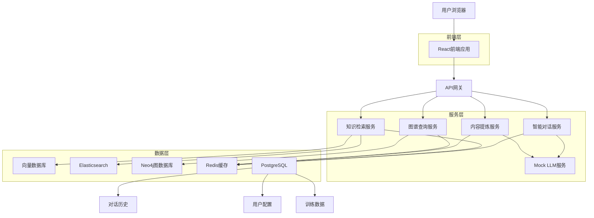
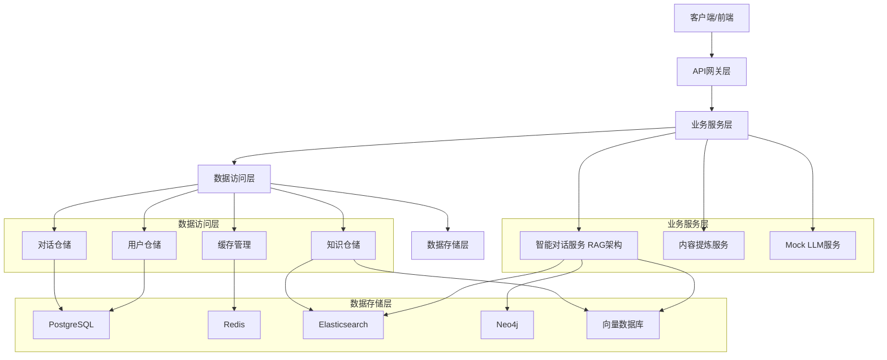
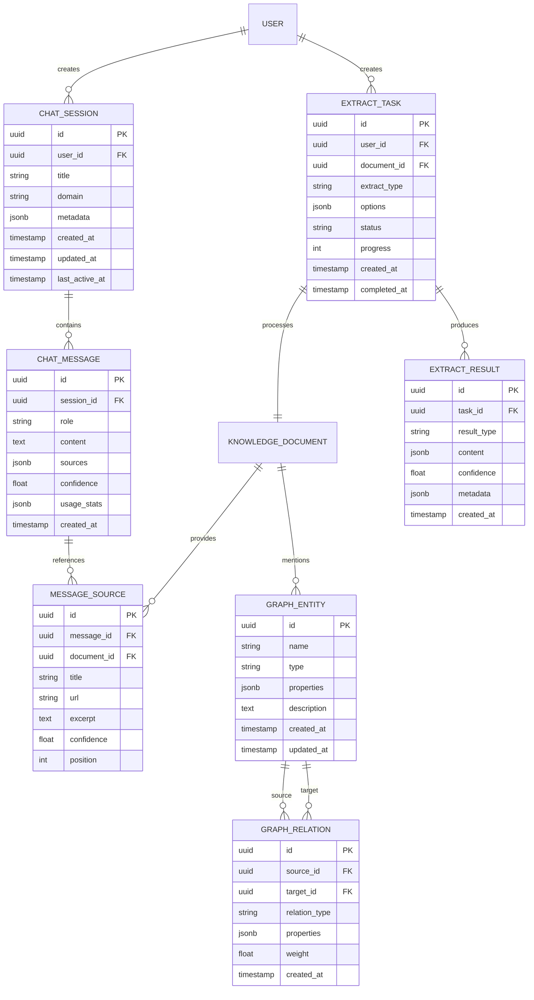
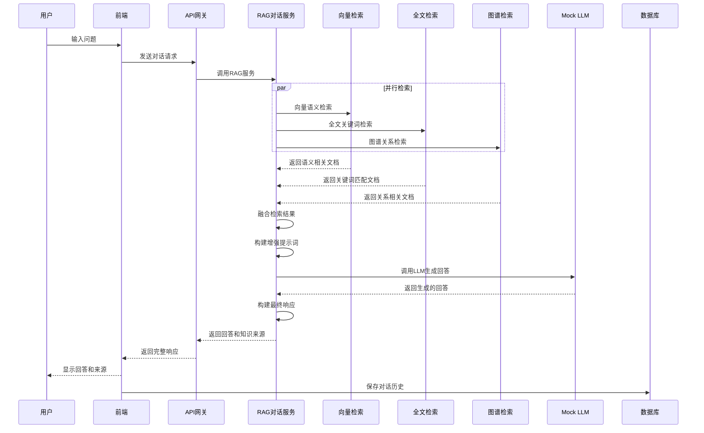

# 智能对话功能模块技术架构文档

## 1. 架构设计



## 2. 技术描述

* **前端**：React\@18 + TypeScript\@5.8 + Ant Design\@5.27 + Vite\@6.3

* **后端**：Spring Cloud + Java\@17 + FastAPI + Python\@3.13

* **AI服务**：Mock LLM服务 + 向量检索 + 自然语言处理

* **数据库**：PostgreSQL\@14 + Redis\@7 + Elasticsearch\@8 + Neo4j\@5

* **消息队列**：Apache Kafka\@3.5

* **容器化**：Docker + Kubernetes

* **监控**：Prometheus + Grafana + ELK Stack

## 3. 路由定义

| 路由                 | 用途                  |
| ------------------ | ------------------- |
| /chat              | 智能对话界面，提供对话窗口和历史记录  |
| /chat/history      | 对话历史页面，管理和搜索历史对话    |
| /knowledge/search  | 知识检索页面，智能搜索和结果展示    |
| /knowledge/extract | 内容提炼工作台，文档分析和信息抽取   |
| /knowledge/graph   | 知识图谱查询页面，图谱可视化和关系探索 |
| /admin/chat        | 对话管理后台，模型配置和质量监控    |
| /admin/training    | 训练数据管理，样本管理和模型优化    |
| /settings/chat     | 个人对话设置，偏好配置和隐私控制    |

## 4. API定义

### 4.1 核心API

#### 智能对话相关

```
POST /api/chat/completions
```

**请求参数：**

| 参数名称             | 参数类型           | 是否必需  | 描述               |
| ---------------- | -------------- | ----- | ---------------- |
| messages         | Array<Message> | true  | 对话消息列表           |
| session\_id      | string         | false | 会话ID，用于上下文管理     |
| user\_id         | string         | true  | 用户ID             |
| domain           | string         | false | 领域标识，如"技术"、"业务"等 |
| temperature      | number         | false | 生成随机性，默认0.7      |
| max\_tokens      | number         | false | 最大生成长度，默认1000    |
| include\_sources | boolean        | false | 是否包含知识来源，默认true  |

**响应参数：**

| 参数名称        | 参数类型          | 描述        |
| ----------- | ------------- | --------- |
| id          | string        | 响应唯一标识    |
| content     | string        | AI生成的回答内容 |
| sources     | Array<Source> | 知识来源列表    |
| confidence  | number        | 回答置信度评分   |
| usage       | Usage         | Token使用统计 |
| created\_at | timestamp     | 创建时间      |

**请求示例：**

```json
{
  "messages": [
    {
      "role": "user",
      "content": "请介绍一下企业级知识库的权限管理体系"
    }
  ],
  "session_id": "sess_123456",
  "user_id": "user_789",
  "domain": "knowledge_management",
  "temperature": 0.7,
  "include_sources": true
}
```

**响应示例：**

```json
{
  "id": "resp_abc123",
  "content": "企业级知识库的权限管理体系通常采用三级架构：部门级权限、角色级权限和个人级权限。具体包括...",
  "sources": [
    {
      "title": "企业级知识库管理规范",
      "url": "/knowledge/doc/kb_management_spec",
      "confidence": 0.95,
      "excerpt": "权限管理体系采用三级架构..."
    }
  ],
  "confidence": 0.92,
  "usage": {
    "prompt_tokens": 150,
    "completion_tokens": 300,
    "total_tokens": 450
  },
  "created_at": "2024-12-19T10:30:00Z"
}
```


#### 内容提炼相关

```
POST /api/knowledge/extract
```

**请求参数：**

| 参数名称          | 参数类型           | 是否必需  | 描述                                       |
| ------------- | -------------- | ----- | ---------------------------------------- |
| document\_id  | string         | true  | 文档ID                                     |
| extract\_type | string         | true  | 提炼类型：summary/entities/relations/keywords |
| options       | ExtractOptions | false | 提炼选项配置                                   |

**响应参数：**

| 参数名称     | 参数类型          | 描述                                       |
| -------- | ------------- | ---------------------------------------- |
| task\_id | string        | 任务ID                                     |
| status   | string        | 处理状态：pending/processing/completed/failed |
| result   | ExtractResult | 提炼结果                                     |
| progress | number        | 处理进度百分比                                  |


## 5. 服务架构图



## 6. 数据模型

### 6.1 数据模型定义



### 6.2 数据定义语言

#### 对话会话表 (chat\_sessions)

```sql
-- 创建对话会话表
CREATE TABLE chat_sessions (
    id UUID PRIMARY KEY DEFAULT gen_random_uuid(),
    user_id UUID NOT NULL REFERENCES users(id),
    title VARCHAR(200) NOT NULL,
    domain VARCHAR(50) DEFAULT 'general',
    metadata JSONB DEFAULT '{}',
    created_at TIMESTAMP WITH TIME ZONE DEFAULT NOW(),
    updated_at TIMESTAMP WITH TIME ZONE DEFAULT NOW(),
    last_active_at TIMESTAMP WITH TIME ZONE DEFAULT NOW()
);

-- 创建索引
CREATE INDEX idx_chat_sessions_user_id ON chat_sessions(user_id);
CREATE INDEX idx_chat_sessions_domain ON chat_sessions(domain);
CREATE INDEX idx_chat_sessions_last_active ON chat_sessions(last_active_at DESC);

-- 设置权限
GRANT SELECT ON chat_sessions TO anon;
GRANT ALL PRIVILEGES ON chat_sessions TO authenticated;
```

#### 对话消息表 (chat\_messages)

```sql
-- 创建对话消息表
CREATE TABLE chat_messages (
    id UUID PRIMARY KEY DEFAULT gen_random_uuid(),
    session_id UUID NOT NULL REFERENCES chat_sessions(id) ON DELETE CASCADE,
    role VARCHAR(20) NOT NULL CHECK (role IN ('user', 'assistant', 'system')),
    content TEXT NOT NULL,
    sources JSONB DEFAULT '[]',
    confidence FLOAT DEFAULT 0.0 CHECK (confidence >= 0.0 AND confidence <= 1.0),
    usage_stats JSONB DEFAULT '{}',
    created_at TIMESTAMP WITH TIME ZONE DEFAULT NOW()
);

-- 创建索引
CREATE INDEX idx_chat_messages_session_id ON chat_messages(session_id);
CREATE INDEX idx_chat_messages_created_at ON chat_messages(created_at DESC);
CREATE INDEX idx_chat_messages_role ON chat_messages(role);

-- 设置权限
GRANT SELECT ON chat_messages TO anon;
GRANT ALL PRIVILEGES ON chat_messages TO authenticated;
```

#### 消息来源表 (message\_sources)

```sql
-- 创建消息来源表
CREATE TABLE message_sources (
    id UUID PRIMARY KEY DEFAULT gen_random_uuid(),
    message_id UUID NOT NULL REFERENCES chat_messages(id) ON DELETE CASCADE,
    document_id UUID NOT NULL,
    title VARCHAR(500) NOT NULL,
    url VARCHAR(1000),
    excerpt TEXT,
    confidence FLOAT DEFAULT 0.0 CHECK (confidence >= 0.0 AND confidence <= 1.0),
    position INTEGER DEFAULT 0,
    created_at TIMESTAMP WITH TIME ZONE DEFAULT NOW()
);

-- 创建索引
CREATE INDEX idx_message_sources_message_id ON message_sources(message_id);
CREATE INDEX idx_message_sources_document_id ON message_sources(document_id);
CREATE INDEX idx_message_sources_confidence ON message_sources(confidence DESC);

-- 设置权限
GRANT SELECT ON message_sources TO anon;
GRANT ALL PRIVILEGES ON message_sources TO authenticated;
```

#### 内容提炼任务表 (extract\_tasks)

```sql
-- 创建内容提炼任务表
CREATE TABLE extract_tasks (
    id UUID PRIMARY KEY DEFAULT gen_random_uuid(),
    user_id UUID NOT NULL REFERENCES users(id),
    document_id UUID NOT NULL,
    extract_type VARCHAR(50) NOT NULL CHECK (extract_type IN ('summary', 'entities', 'relations', 'keywords', 'structure')),
    options JSONB DEFAULT '{}',
    status VARCHAR(20) DEFAULT 'pending' CHECK (status IN ('pending', 'processing', 'completed', 'failed')),
    progress INTEGER DEFAULT 0 CHECK (progress >= 0 AND progress <= 100),
    error_message TEXT,
    created_at TIMESTAMP WITH TIME ZONE DEFAULT NOW(),
    completed_at TIMESTAMP WITH TIME ZONE
);

-- 创建索引
CREATE INDEX idx_extract_tasks_user_id ON extract_tasks(user_id);
CREATE INDEX idx_extract_tasks_status ON extract_tasks(status);
CREATE INDEX idx_extract_tasks_created_at ON extract_tasks(created_at DESC);

-- 设置权限
GRANT SELECT ON extract_tasks TO anon;
GRANT ALL PRIVILEGES ON extract_tasks TO authenticated;
```

#### 提炼结果表 (extract\_results)

```sql
-- 创建提炼结果表
CREATE TABLE extract_results (
    id UUID PRIMARY KEY DEFAULT gen_random_uuid(),
    task_id UUID NOT NULL REFERENCES extract_tasks(id) ON DELETE CASCADE,
    result_type VARCHAR(50) NOT NULL,
    content JSONB NOT NULL,
    confidence FLOAT DEFAULT 0.0 CHECK (confidence >= 0.0 AND confidence <= 1.0),
    metadata JSONB DEFAULT '{}',
    created_at TIMESTAMP WITH TIME ZONE DEFAULT NOW()
);

-- 创建索引
CREATE INDEX idx_extract_results_task_id ON extract_results(task_id);
CREATE INDEX idx_extract_results_type ON extract_results(result_type);
CREATE INDEX idx_extract_results_confidence ON extract_results(confidence DESC);

-- 设置权限
GRANT SELECT ON extract_results TO anon;
GRANT ALL PRIVILEGES ON extract_results TO authenticated;
```

#### 知识图谱实体表 (graph\_entities)

```sql
-- 创建知识图谱实体表
CREATE TABLE graph_entities (
    id UUID PRIMARY KEY DEFAULT gen_random_uuid(),
    name VARCHAR(200) NOT NULL,
    type VARCHAR(50) NOT NULL,
    properties JSONB DEFAULT '{}',
    description TEXT,
    created_at TIMESTAMP WITH TIME ZONE DEFAULT NOW(),
    updated_at TIMESTAMP WITH TIME ZONE DEFAULT NOW()
);

-- 创建索引
CREATE UNIQUE INDEX idx_graph_entities_name_type ON graph_entities(name, type);
CREATE INDEX idx_graph_entities_type ON graph_entities(type);
CREATE INDEX idx_graph_entities_name ON graph_entities USING gin(to_tsvector('english', name));

-- 设置权限
GRANT SELECT ON graph_entities TO anon;
GRANT ALL PRIVILEGES ON graph_entities TO authenticated;
```

#### 知识图谱关系表 (graph\_relations)

```sql
-- 创建知识图谱关系表
CREATE TABLE graph_relations (
    id UUID PRIMARY KEY DEFAULT gen_random_uuid(),
    source_id UUID NOT NULL REFERENCES graph_entities(id) ON DELETE CASCADE,
    target_id UUID NOT NULL REFERENCES graph_entities(id) ON DELETE CASCADE,
    relation_type VARCHAR(100) NOT NULL,
    properties JSONB DEFAULT '{}',
    weight FLOAT DEFAULT 1.0 CHECK (weight > 0.0),
    created_at TIMESTAMP WITH TIME ZONE DEFAULT NOW()
);

-- 创建索引
CREATE INDEX idx_graph_relations_source_id ON graph_relations(source_id);
CREATE INDEX idx_graph_relations_target_id ON graph_relations(target_id);
CREATE INDEX idx_graph_relations_type ON graph_relations(relation_type);
CREATE INDEX idx_graph_relations_weight ON graph_relations(weight DESC);

-- 设置权限
GRANT SELECT ON graph_relations TO anon;
GRANT ALL PRIVILEGES ON graph_relations TO authenticated;
```

#### 初始化数据

```sql
-- 插入示例对话会话
INSERT INTO chat_sessions (user_id, title, domain) VALUES 
('550e8400-e29b-41d4-a716-446655440000', '企业知识库咨询', 'knowledge_management'),
('550e8400-e29b-41d4-a716-446655440001', '技术架构讨论', 'technical'),
('550e8400-e29b-41d4-a716-446655440002', '业务流程优化', 'business');

-- 插入示例图谱实体
INSERT INTO graph_entities (name, type, description) VALUES 
('企业级知识库', 'system', '企业内部知识管理系统'),
('权限管理', 'module', '系统权限控制模块'),
('用户角色', 'concept', '系统中的用户角色定义'),
('知识分类', 'concept', '知识内容的分类体系'),
('审核流程', 'process', '知识内容的审核处理流程');

-- 插入示例图谱关系
INSERT INTO graph_relations (source_id, target_id, relation_type, weight) 
SELECT 
    e1.id, e2.id, 'contains', 0.9
FROM graph_entities e1, graph_entities e2 
WHERE e1.name = '企业级知识库' AND e2.name = '权限管理';

INSERT INTO graph_relations (source_id, target_id, relation_type, weight) 
SELECT 
    e1.id, e2.id, 'manages', 0.8
FROM graph_entities e1, graph_entities e2 
WHERE e1.name = '权限管理' AND e2.name = '用户角色';
```

## 7. Mock LLM服务实现

### 7.1 RAG对话数据流



### 7.2 RAG智能对话服务架构

```python
# RAG智能对话服务主要组件
class RAGChatService:
    def __init__(self):
        self.template_engine = TemplateEngine()
        self.vector_retriever = VectorRetriever()  # 向量检索
        self.text_retriever = TextRetriever()      # 全文检索
        self.graph_retriever = GraphRetriever()    # 图谱检索
        self.llm_service = MockLLMService()        # LLM服务
        self.response_generator = ResponseGenerator()
        self.context_manager = ContextManager()
    
    async def chat_completion(self, request: ChatRequest) -> ChatResponse:
        # 1. 理解用户意图
        intent = await self.analyze_intent(request.messages[-1].content)
        
        # 2. 并行执行多种检索策略
        vector_knowledge = await self.vector_retriever.search(
            query=request.messages[-1].content,
            domain=request.context.domain,
            user_id=request.context.user_id
        )
        
        text_knowledge = await self.text_retriever.search(
            query=request.messages[-1].content,
            domain=request.context.domain,
            user_id=request.context.user_id
        )
        
        graph_knowledge = await self.graph_retriever.search(
            query=request.messages[-1].content,
            domain=request.context.domain,
            user_id=request.context.user_id
        )
        
        # 3. 融合检索结果
        combined_knowledge = self.merge_knowledge_results(
            vector_knowledge, text_knowledge, graph_knowledge
        )
        
        # 4. 构建增强提示词
        enhanced_prompt = self.build_rag_prompt(
            user_query=request.messages[-1].content,
            knowledge=combined_knowledge,
            context=self.context_manager.get_context(request.context.session_id)
        )
        
        # 5. 调用LLM生成回答
        llm_response = await self.llm_service.generate(
            prompt=enhanced_prompt,
            temperature=request.options.temperature,
            max_tokens=request.options.max_tokens
        )
        
        # 6. 构建最终响应
        response = await self.response_generator.build_response(
            llm_response=llm_response,
            knowledge_sources=combined_knowledge,
            intent=intent
        )
        
        # 7. 更新上下文
        self.context_manager.update_context(
            session_id=request.context.session_id,
            message=request.messages[-1],
            response=response
        )
        
        return response
```

### 7.2 多模态知识检索实现

```python
class VectorRetriever:
    """向量检索器 - 基于语义相似度检索"""
    def __init__(self):
        self.vector_store = VectorStore()
        self.embedding_model = EmbeddingModel()
    
    async def search(self, query: str, domain: str, user_id: str) -> List[KnowledgeItem]:
        # 生成查询向量
        query_vector = await self.embedding_model.encode(query)
        
        # 向量相似度搜索
        results = await self.vector_store.similarity_search(
            vector=query_vector,
            top_k=10,
            filters={'domain': domain}
        )
        
        # 权限过滤
        filtered_results = await self.filter_by_permissions(results, user_id)
        
        return filtered_results

class TextRetriever:
    """全文检索器 - 基于关键词匹配检索"""
    def __init__(self):
        self.elasticsearch = ElasticsearchClient()
    
    async def search(self, query: str, domain: str, user_id: str) -> List[KnowledgeItem]:
        # 构建Elasticsearch查询
        search_query = {
            "query": {
                "bool": {
                    "must": [
                        {"multi_match": {
                            "query": query,
                            "fields": ["title^2", "content", "tags"]
                        }}
                    ],
                    "filter": [
                        {"term": {"domain": domain}}
                    ]
                }
            },
            "highlight": {
                "fields": {
                    "content": {}
                }
            }
        }
        
        # 执行搜索
        results = await self.elasticsearch.search(
            index="knowledge_documents",
            body=search_query,
            size=10
        )
        
        # 权限过滤
        filtered_results = await self.filter_by_permissions(results, user_id)
        
        return filtered_results

class GraphRetriever:
    """图谱检索器 - 基于实体关系检索"""
    def __init__(self):
        self.neo4j_client = Neo4jClient()
        self.entity_extractor = EntityExtractor()
    
    async def search(self, query: str, domain: str, user_id: str) -> List[KnowledgeItem]:
        # 提取查询中的实体
        entities = await self.entity_extractor.extract(query)
        
        if not entities:
            return []
        
        # 构建Cypher查询
        cypher_query = """
        MATCH (e:Entity)-[r]->(related:Entity)-[:MENTIONED_IN]->(doc:Document)
        WHERE e.name IN $entities AND doc.domain = $domain
        RETURN doc, r, related, e
        ORDER BY r.weight DESC
        LIMIT 10
        """
        
        # 执行图谱查询
        results = await self.neo4j_client.run(
            cypher_query,
            entities=[e.name for e in entities],
            domain=domain
        )
        
        # 权限过滤
        filtered_results = await self.filter_by_permissions(results, user_id)
        
        return filtered_results
```

### 7.3 知识融合和响应生成实现

```python
class KnowledgeFusion:
    """知识融合器 - 整合多种检索结果"""
    def __init__(self):
        self.similarity_calculator = SimilarityCalculator()
        self.relevance_scorer = RelevanceScorer()
    
    def merge_knowledge_results(self, vector_results: List[KnowledgeItem], 
                              text_results: List[KnowledgeItem], 
                              graph_results: List[KnowledgeItem]) -> List[KnowledgeItem]:
        # 去重合并
        all_results = {}
        
        # 添加向量检索结果（权重0.4）
        for item in vector_results:
            item.score = item.score * 0.4
            item.source_type = 'vector'
            all_results[item.id] = item
        
        # 添加全文检索结果（权重0.3）
        for item in text_results:
            if item.id in all_results:
                all_results[item.id].score += item.score * 0.3
                all_results[item.id].source_type += '+text'
            else:
                item.score = item.score * 0.3
                item.source_type = 'text'
                all_results[item.id] = item
        
        # 添加图谱检索结果（权重0.3）
        for item in graph_results:
            if item.id in all_results:
                all_results[item.id].score += item.score * 0.3
                all_results[item.id].source_type += '+graph'
            else:
                item.score = item.score * 0.3
                item.source_type = 'graph'
                all_results[item.id] = item
        
        # 按综合得分排序
        sorted_results = sorted(all_results.values(), key=lambda x: x.score, reverse=True)
        
        return sorted_results[:5]  # 返回前5个最相关的结果

class RAGPromptBuilder:
    """RAG提示词构建器"""
    def __init__(self):
        self.prompt_templates = self.load_prompt_templates()
    
    def build_rag_prompt(self, user_query: str, knowledge: List[KnowledgeItem], context: Context) -> str:
        # 构建知识上下文
        knowledge_context = "\n\n".join([
            f"知识片段{i+1}（来源：{item.title}，相关度：{item.score:.2f}）：\n{item.content}"
            for i, item in enumerate(knowledge)
        ])
        
        # 构建对话历史上下文
        history_context = "\n".join([
            f"{msg.role}: {msg.content}"
            for msg in context.recent_messages[-3:]  # 最近3轮对话
        ])
        
        # 构建完整提示词
        prompt = f"""
你是一个专业的企业知识库助手，请基于以下知识内容回答用户问题。

## 相关知识：
{knowledge_context}

## 对话历史：
{history_context}

## 用户问题：
{user_query}

## 回答要求：
1. 基于提供的知识内容进行回答
2. 如果知识内容不足以回答问题，请明确说明
3. 回答要准确、简洁、有条理
4. 可以引用具体的知识来源
5. 保持专业和友好的语调

请回答：
"""
        
        return prompt

class ResponseGenerator:
    """响应生成器 - 构建最终回答"""
    def __init__(self):
        self.quality_checker = QualityChecker()
        self.source_formatter = SourceFormatter()
    
    async def build_response(self, llm_response: str, knowledge_sources: List[KnowledgeItem], intent: Intent) -> ChatResponse:
        # 质量检查和优化
        optimized_content = await self.quality_checker.optimize(llm_response)
        
        # 格式化知识来源
        formatted_sources = [
            {
                "title": item.title,
                "url": item.url,
                "excerpt": item.content[:200] + "..." if len(item.content) > 200 else item.content,
                "confidence": item.score,
                "source_type": item.source_type
            }
            for item in knowledge_sources
        ]
        
        # 计算整体置信度
        overall_confidence = self.calculate_overall_confidence(knowledge_sources, intent)
        
        # 构建响应
        response = ChatResponse(
            content=optimized_content,
            sources=formatted_sources,
            confidence=overall_confidence,
            usage=self.calculate_usage(llm_response),
            metadata={
                "retrieval_strategy": "rag_multi_modal",
                "knowledge_count": len(knowledge_sources),
                "intent_type": intent.type
            }
        )
        
        return response
    
    def calculate_overall_confidence(self, knowledge_sources: List[KnowledgeItem], intent: Intent) -> float:
        if not knowledge_sources:
            return 0.1
        
        # 基于知识源质量和意图匹配度计算置信度
        avg_knowledge_score = sum(item.score for item in knowledge_sources) / len(knowledge_sources)
        intent_confidence = intent.confidence if hasattr(intent, 'confidence') else 0.8
        
        # 综合计算
        overall_confidence = (avg_knowledge_score * 0.7 + intent_confidence * 0.3)
        
        return min(overall_confidence, 0.95)  # 最高不超过0.95
```

## 8. 部署和运维

### 8.1 容器化部署

```dockerfile
# RAG智能对话服务 Dockerfile
FROM python:3.13-slim

WORKDIR /app

# 安装系统依赖
RUN apt-get update && apt-get install -y \
    gcc \
    g++ \
    && rm -rf /var/lib/apt/lists/*

COPY requirements.txt .
RUN pip install --no-cache-dir -r requirements.txt

COPY . .

EXPOSE 8000

# 启动RAG服务
CMD ["uvicorn", "rag_chat_service:app", "--host", "0.0.0.0", "--port", "8000"]
```

```yaml
# RAG智能对话服务 Kubernetes部署配置
apiVersion: apps/v1
kind: Deployment
metadata:
  name: rag-chat-service
spec:
  replicas: 3
  selector:
    matchLabels:
      app: rag-chat-service
  template:
    metadata:
      labels:
        app: rag-chat-service
    spec:
      containers:
      - name: rag-chat
        image: rag-chat-service:latest
        ports:
        - containerPort: 8000
        env:
        - name: DATABASE_URL
          valueFrom:
            secretKeyRef:
              name: db-secret
              key: url
        - name: ELASTICSEARCH_URL
          valueFrom:
            secretKeyRef:
              name: es-secret
              key: url
        - name: NEO4J_URL
          valueFrom:
            secretKeyRef:
              name: neo4j-secret
              key: url
        - name: REDIS_URL
          valueFrom:
            secretKeyRef:
              name: redis-secret
              key: url
        - name: VECTOR_DB_URL
          valueFrom:
            secretKeyRef:
              name: vector-db-secret
              key: url
        resources:
          requests:
            memory: "1Gi"
            cpu: "500m"
          limits:
            memory: "2Gi"
            cpu: "1000m"
---
apiVersion: v1
kind: Service
metadata:
  name: rag-chat-service
spec:
  selector:
    app: rag-chat-service
  ports:
  - protocol: TCP
    port: 80
    targetPort: 8000
  type: ClusterIP
```

### 8.2 监控和日志

```yaml
# Prometheus监控配置
apiVersion: v1
kind: ConfigMap
metadata:
  name: prometheus-config
data:
  prometheus.yml: |
    global:
      scrape_interval: 15s
    scrape_configs:
    - job_name: 'mock-llm-service'
      static_configs:
      - targets: ['mock-llm-service:8000']
      metrics_path: '/metrics'
      scrape_interval: 10s
```

### 8.3 性能优化

* **缓存策略**：使用Redis缓存频繁查询的结果，设置合理的过期时间

* **连接池**：配置数据库连接池，优化数据库访问性能

* **异步处理**：使用异步编程模型，提高并发处理能力

* **负载均衡**：部署多个服务实例，使用负载均衡器分发请求

* **CDN加速**：静态资源使用CDN加速，减少网络延迟

***

*本文档版本：v1.0*\
*最后更新时间：2025年9月*\
*文档作者：伍志勇*
