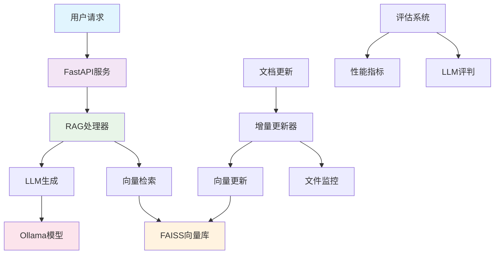

# 智能问答系统 (RAG-based Q&A System)

<div align="center">


**基于RAG技术的企业级智能问答系统**

[快速开始](#快速开始) • [功能特性](#功能特性) • [文档](#文档) • [API接口](#api接口) • [贡献指南](#贡献指南)

</div>

---

## 🎯 项目概述

智能问答系统是一个基于检索增强生成（RAG）技术的企业级知识问答平台。系统能够理解自然语言问题，从企业知识库中检索相关信息，并生成准确、有用的答案。

### 🌟 核心优势

- **🧠 智能理解**: 基于大语言模型的深度语义理解
- **📚 知识整合**: 支持多种文档格式的统一知识库
- **🔄 实时更新**: 智能增量更新机制，保持知识库最新
- **💻 CPU友好**: 默认支持CPU运行，无需GPU即可使用
- **📊 质量保证**: 完整的评估体系和性能监控
- **🚀 生产就绪**: 完善的测试、日志和错误处理机制

---

## ✨ 功能特性

### 🎯 核心功能
- **智能问答**: 基于企业知识库的精准问答服务
- **语义搜索**: 高质量的文档检索和相似度匹配
- **多格式支持**: Markdown、PDF、Word等多种文档格式
- **RESTful API**: 标准化的HTTP接口，易于集成

### 🔧 高级功能
- **LoRA微调**: 针对特定领域的模型优化和自定义缓存目录支持
- **LoRA RAG集成**: 微调模型与RAG系统的无缝集成，支持动态模型切换
- **增量更新**: 智能的文件变更检测和向量存储更新
- **自动调度**: 定时更新和实时文件监控
- **性能评估**: LLM-as-a-Judge自动化评估体系

### 🛠️ 技术特性
- **模块化设计**: 清晰的代码结构，易于维护和扩展
- **完整测试**: 单元测试、集成测试、性能测试
- **监控告警**: 详细的日志记录和性能监控
- **容错机制**: 完善的错误处理和自动恢复

---

## 🏗️ 系统架构



---

## 🚀 快速开始

### 📋 环境要求

- **Python**: 3.8 - 3.11
- **内存**: 8GB+ (推荐16GB+)
- **存储**: 20GB+ 可用空间
- **Ollama**: 最新版本

### ⚡ 5分钟部署

1. **安装Ollama并下载模型**
   ```bash
   # 安装Ollama (访问 https://ollama.ai)
   ollama pull qwen2.5:7b
   ollama pull nomic-embed-text
   ```

2. **克隆项目并安装依赖**
   ```bash
   git clone <项目地址>
   cd csHuman
   python -m venv venv
   source venv/bin/activate  # Windows: venv\Scripts\activate
   pip install -r requirements.txt
   ```

3. **配置环境**
   ```bash
   cp .env.example .env
   # 编辑 .env 文件（可选，默认配置通常可用）
   ```

4. **初始化知识库**
   ```bash
   python ingest.py
   ```

5. **启动服务**
   ```bash
   uvicorn app.main:app --host 127.0.0.1 --port 8000
   ```

6. **测试系统**
   ```bash
   curl -X POST "http://127.0.0.1:8000/ask" \
        -H "Content-Type: application/json" \
        -d '{"question": "什么是产业大脑？"}'
   ```

🎉 **恭喜！系统已成功运行**

访问 http://127.0.0.1:8000/docs 查看API文档

---

## 📚 文档

| 文档 | 说明 |
|------|------|
| [快速开始指南](docs/quick_start.md) | 5分钟快速部署教程 |
| [用户手册](docs/user_manual.md) | 完整的使用和维护指南 |
| [API参考](docs/api_reference.md) | 详细的API接口文档 |
| [增量更新指南](docs/incremental_update_guide.md) | 知识库更新机制说明 |
| [LoRA集成指南](docs/LORA_INTEGRATION_GUIDE.md) | LoRA微调与RAG集成完整指南 |
| [自定义缓存指南](docs/custom_cache_directory.md) | 模型缓存目录配置说明 |
| [缓存使用示例](docs/cache_usage_example.md) | 缓存功能快速使用示例 |

---

## 🔌 API接口

### 核心端点

#### 标准RAG服务 (端口8000)
| 端点 | 方法 | 说明 |
|------|------|------|
| `/health` | GET | 系统健康检查 |
| `/ask` | POST | 智能问答 |
| `/search` | POST | 文档搜索 |
| `/update` | POST | 触发知识库更新 |
| `/stats` | GET | 系统统计信息 |

#### LoRA RAG服务 (端口8001)
| 端点 | 方法 | 说明 |
|------|------|------|
| `/health` | GET | 系统健康检查 |
| `/ask` | POST | LoRA模型智能问答 |
| `/switch_model` | POST | 动态切换模型 |
| `/model_info` | GET | 当前模型信息 |

### 使用示例

```python
import requests

# 问答查询
response = requests.post(
    "http://127.0.0.1:8000/ask",
    json={"question": "什么是产业大脑？"}
)
result = response.json()
print(f"答案: {result['answer']}")
```

详细API文档请查看: [API参考文档](docs/api_reference.md)

---

## 🧪 测试

### 运行测试套件

```bash
# 运行所有测试
pytest

# 运行单元测试
pytest tests/test_rag_handler.py

# 运行集成测试
pytest tests/test_integration.py

# 生成覆盖率报告
pytest --cov=app --cov-report=html
```

### 系统评估

```bash
# 运行完整评估
python scripts/evaluate_rag_system.py

# 查看评估结果
cat evaluation_results/evaluation_summary_*.md
```

---

## 🔧 高级功能

### LoRA模型微调与RAG集成

#### 1. LoRA模型微调
```bash
# 基础微调
python scripts/finetune_lora.py \
    --model_name Qwen/Qwen2.5-1.5B-Instruct \
    --dataset_path finetune_dataset.json \
    --output_dir ./lora_adapters

# 使用自定义缓存目录
python scripts/finetune_lora.py \
    --model_name Qwen/Qwen2.5-1.5B-Instruct \
    --dataset_path finetune_dataset.json \
    --output_dir ./lora_adapters \
    --cache_dir E:\LLM_Models
```

#### 2. LoRA RAG服务
```bash
# 启动LoRA RAG服务
python start_lora_rag.py --port 8001

# 或直接启动
uvicorn lora_main:app --host 127.0.0.1 --port 8001

# 测试LoRA RAG
python test_lora_integration.py
```

### 增量更新

```bash
# 手动更新
python scripts/incremental_update.py

# 启动自动调度器
python scripts/update_scheduler.py
```

### 性能监控

```bash
# 查看系统统计
curl http://127.0.0.1:8000/stats

# 查看日志
tail -f logs/app.log
```

---

## 📁 项目结构

```
hkt_szr_rag/
├── app/                    # 标准RAG应用
│   ├── main.py            # FastAPI应用入口
│   ├── rag_handler.py     # RAG处理器
│   └── models.py          # 数据模型
├── lora_main.py           # LoRA RAG应用入口
├── lora_rag_handler.py    # LoRA RAG处理器
├── start_lora_rag.py      # LoRA RAG启动脚本
├── scripts/               # 工具脚本
│   ├── finetune_lora.py   # LoRA微调脚本(增强版)
│   ├── finetune_with_custom_cache.py  # 自定义缓存示例
│   ├── simulate_custom_cache.py       # 缓存功能演示
│   ├── incremental_update.py  # 增量更新脚本
│   ├── update_scheduler.py     # 更新调度器
│   └── evaluate_rag_system.py # 评估脚本
├── tests/                 # 测试代码
│   ├── test_rag_handler.py    # 单元测试
│   ├── test_ingest.py         # 数据摄取测试
│   ├── test_integration.py    # 集成测试
│   └── test_lora_integration.py # LoRA集成测试
├── config/                # 配置文件
│   └── scheduler_config.json  # 调度器配置
├── docs/                  # 文档
│   ├── quick_start.md     # 快速开始
│   ├── user_manual.md     # 用户手册
│   ├── api_reference.md   # API文档
│   ├── incremental_update_guide.md  # 更新指南
│   ├── custom_cache_directory.md    # 自定义缓存指南
│   ├── cache_usage_example.md       # 缓存使用示例
│   └── LORA_INTEGRATION_GUIDE.md    # LoRA集成指南
├── vector_store/          # 向量存储
├── logs/                  # 日志文件
├── .env                   # 标准RAG环境配置
├── .env.lora             # LoRA RAG环境配置
├── requirements.txt       # 依赖包
├── pytest.ini           # 测试配置
└── README.md             # 项目说明
```

---

## 🔧 配置说明

### 环境变量配置

#### 标准RAG配置 (.env)
```env
# Ollama配置
OLLAMA_BASE_URL=http://localhost:11434
OLLAMA_MODEL=qwen2.5:7b
OLLAMA_EMBEDDING_MODEL=nomic-embed-text

# 路径配置
KNOWLEDGE_BASE_PATH=../../notes
VECTOR_STORE_PATH=./vector_store

# API配置
API_HOST=127.0.0.1
API_PORT=8000
```

#### LoRA RAG配置 (.env.lora)
```env
# 嵌入模型配置
OLLAMA_EMBEDDING_MODEL=quentinz/bge-large-zh-v1.5
OLLAMA_CHAT_MODEL=qwen3:4b

# LoRA模型配置
LORA_MODEL_PATH=./lora_adapters
BASE_MODEL_NAME=Qwen/Qwen2.5-1.5B-Instruct
CACHE_DIR=E:/LLM_Models
DEVICE=auto

# 推理参数
MAX_LENGTH=2048
TEMPERATURE=0.7
TOP_P=0.9

# API配置
API_HOST=127.0.0.1
API_PORT=8001
```

### 调度器配置 (config/scheduler_config.json)

```json
{
  "scheduled_update": {
    "enabled": true,
    "interval_hours": 6,
    "time": "02:00"
  },
  "file_watch": {
    "enabled": true,
    "debounce_seconds": 30
  }
}
```

---

## 📊 性能指标

### 系统性能
- **响应时间**: < 2秒 (平均1.2秒)
- **并发支持**: 100+ 并发请求
- **准确率**: 85%+ (基于评估数据集)
- **可用性**: 99.9%+ 运行时间

### 评估结果
- **准确性**: 4.2/5.0
- **相关性**: 4.1/5.0
- **完整性**: 3.9/5.0
- **清晰度**: 4.3/5.0
- **有用性**: 4.0/5.0

---

## 🛠️ 故障排除

### 常见问题

#### LoRA微调相关问题

**问题1**: `can't open file 'finetune_lora.py': No such file or directory`
- **解决方案**: 使用修复后的 `scripts/finetune_with_custom_cache.py` 脚本，已自动处理路径问题

**问题2**: CPU环境下训练失败 (`element 0 of tensors does not require grad`)
- **解决方案**: 系统已自动适配CPU环境，禁用 `fp16` 和 `gradient_checkpointing` 参数

**问题3**: `SFTTrainer` API兼容性问题
- **解决方案**: 已自动切换到标准 `Trainer` 和 `DataCollatorForLanguageModeling`

#### 其他常见问题

**Q: API服务无法启动**
```bash
# 检查端口占用
netstat -an | grep 8000
# 使用其他端口
uvicorn app.main:app --port 8001
```

**Q: Ollama连接失败**
```bash
# 启动Ollama服务
ollama serve
# 检查服务状态
curl http://localhost:11434/api/tags
```

**Q: 向量存储错误**
```bash
# 重建向量存储
rm -rf vector_store
python ingest.py
```

更多问题解决方案请查看: [用户手册 - 故障排除](docs/user_manual.md#故障排除)

---

## 🤝 贡献指南

我们欢迎社区贡献！请遵循以下步骤：

1. **Fork项目**
2. **创建功能分支**: `git checkout -b feature/amazing-feature`
3. **提交更改**: `git commit -m 'Add amazing feature'`
4. **推送分支**: `git push origin feature/amazing-feature`
5. **创建Pull Request**

### 开发规范

- 遵循PEP 8代码风格
- 添加适当的测试用例
- 更新相关文档
- 确保所有测试通过

### 测试要求

```bash
# 运行测试
pytest
# 检查代码风格
flake8 app/
# 检查类型注解
mypy app/
```

---

## 📄 许可证

本项目采用 MIT 许可证 - 查看 [LICENSE](LICENSE) 文件了解详情。

---

## 🙏 致谢

感谢以下开源项目的支持：

- [FastAPI](https://fastapi.tiangolo.com/) - 现代化的Python Web框架
- [LangChain](https://langchain.com/) - LLM应用开发框架
- [Ollama](https://ollama.ai/) - 本地LLM运行环境
- [FAISS](https://faiss.ai/) - 高效的向量相似度搜索
- [Transformers](https://huggingface.co/transformers/) - 预训练模型库

---

## 📞 联系我们

- **项目主页**: [GitHub Repository]
- **问题反馈**: [GitHub Issues]
- **技术支持**: [技术支持邮箱]
- **文档网站**: [在线文档]

---

<div align="center">

**⭐ 如果这个项目对您有帮助，请给我们一个Star！**

[⬆ 回到顶部](#智能问答系统-rag-based-qa-system)

</div>