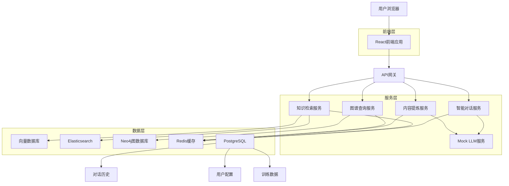

# 企业级知识库管理系统

> **作者**: 伍志勇  
> **版本**: 1.0.0  
> **更新时间**: 2025年1月20日

## 📖 项目概述

企业级知识库管理系统是一个面向企业内部的知识资产管理平台，集成了智能对话、知识检索、内容提炼和知识图谱等先进功能。系统通过AI驱动的对话式交互，帮助企业实现知识的系统化存储、分类、检索和共享，显著提升组织学习能力和业务协同效率。

### 🎯 核心价值

- **智能化知识检索**: 基于RAG架构的多源知识融合检索
- **对话式交互体验**: 自然语言问答，支持多轮对话和上下文理解
- **精细化权限管控**: 三级权限体系，确保知识安全
- **全生命周期管理**: 从创建到归档的完整知识管理流程
- **可视化知识图谱**: 直观展示知识实体关系和知识结构

### 🏢 适用场景

- 企业内部知识库建设
- 技术文档管理和检索
- 客服知识库和FAQ系统
- 培训资料管理
- 项目知识沉淀

## 🔧 系统需求

### 技术栈

#### 前端技术栈
- **框架**: React 18.3.1 + TypeScript 5.8.3
- **UI组件**: Ant Design 5.27.3
- **构建工具**: Vite 6.3.5
- **状态管理**: Zustand 5.0.3
- **路由**: React Router DOM 7.3.0
- **样式**: Tailwind CSS 3.4.17
- **图表**: Ant Design Charts 2.6.4 + Recharts 3.2.0
- **可视化**: D3.js 7.9.0 + React Flow Renderer 10.3.17

#### 后端技术栈
- **微服务框架**: Spring Cloud + Java 17+
- **AI服务**: FastAPI + Python 3.13+
- **数据库**: PostgreSQL 14+ (主数据库)
- **缓存**: Redis 7+ (缓存和会话)
- **搜索引擎**: Elasticsearch 8+ (全文检索)
- **图数据库**: Neo4j 5+ (知识图谱)
- **消息队列**: Apache Kafka 3.5+
- **容器化**: Docker + Kubernetes

#### 开发工具
- **包管理**: pnpm 8.0+ (推荐) 或 npm 9.0+
- **代码规范**: ESLint + TypeScript ESLint
- **版本控制**: Git + GitLab
- **CI/CD**: Jenkins + Docker

### 系统要求

#### 开发环境
- **Node.js**: 22.14.0+ (已安装)
- **操作系统**: Windows 10/11, macOS 12+, Ubuntu 20.04+
- **内存**: 8GB+ (推荐16GB)
- **存储**: 10GB+ 可用空间

#### 生产环境
- **CPU**: 4核心以上
- **内存**: 16GB以上 (推荐32GB)
- **存储**: 100GB以上 SSD
- **网络**: 100Mbps以上带宽
- **操作系统**: Linux (Ubuntu 20.04+/CentOS 8+)

## 🏗️ 架构设计

### 系统架构



### 核心功能模块

#### 1. 知识库管理
- **双树模型**: 主题标签树(业务导向) + 知识图谱(关系导向)
- **权限管控**: 系统管理员、部门管理员、知识贡献者、知识消费者、审核专员
- **生命周期**: 创建 → 审核 → 发布 → 更新 → 过期 → 归档 → 销毁

#### 2. 智能对话系统
- **RAG架构**: 向量检索 + 全文检索 + 知识图谱检索
- **多轮对话**: 上下文理解和连续对话能力
- **知识来源**: 自动标注答案来源和置信度评分

#### 3. 内容提炼工具
- **文档摘要**: 抽取式和生成式摘要
- **信息抽取**: 实体识别、关系抽取、事件抽取
- **结构化输出**: 表格生成和知识点整理

#### 4. 知识图谱
- **可视化展示**: 交互式图谱，支持缩放、拖拽、筛选
- **关系查询**: 实体间路径查找和关系链分析
- **智能推理**: 基于图谱的推理查询

## 🚀 快速开始

### 1. 环境准备

```bash
# 检查 Node.js 版本
node --version  # 应该是 22.14.0+

# 检查 pnpm 版本
pnpm --version  # 推荐使用 pnpm
```

### 2. 克隆项目

```bash
git clone <repository-url>
cd csHuman
```

### 3. 安装依赖

```bash
# 使用 pnpm (推荐)
pnpm install

# 或使用 npm
npm install
```

### 4. 环境配置

创建 `.env` 文件:

```env
# 应用配置
VITE_APP_TITLE=企业级知识库管理系统
VITE_APP_VERSION=1.0.0

# API配置
VITE_API_BASE_URL=http://localhost:8080
VITE_API_TIMEOUT=30000

# 功能开关
VITE_ENABLE_MOCK=true
VITE_ENABLE_DEBUG=true
```

### 5. 启动开发服务器

```bash
# 启动前端开发服务器
pnpm dev

# 或使用部署脚本
bash deploy.sh dev
```

### 6. 访问应用

打开浏览器访问: http://localhost:5173

## 📦 部署指南

### 开发环境部署

```bash
# 使用部署脚本 (推荐)
bash deploy.sh dev

# 或手动启动
pnpm run dev
```

### 测试环境部署

```bash
# 构建测试版本
pnpm run build:test

# 使用部署脚本
bash deploy.sh test
```

### 生产环境部署

#### 方式一: 传统部署

```bash
# 构建生产版本
pnpm run build:prod

# 使用 nginx 或其他 web 服务器托管 dist 目录
```

#### 方式二: Docker 部署

```bash
# 构建 Docker 镜像
docker build -t knowledge-frontend .

# 运行容器
docker run -d \
  --name knowledge-frontend \
  -p 80:80 \
  -e VITE_API_BASE_URL=https://api.example.com \
  knowledge-frontend
```

#### 方式三: Docker Compose 部署

```bash
# 启动所有服务
docker-compose up -d

# 查看服务状态
docker-compose ps

# 查看日志
docker-compose logs -f frontend
```

### Kubernetes 部署

```bash
# 应用 Kubernetes 配置
kubectl apply -f k8s/

# 查看部署状态
kubectl get pods -l app=knowledge-frontend

# 查看服务
kubectl get svc knowledge-frontend
```

## 📚 使用说明

### 主要功能页面

| 路由 | 功能描述 |
|------|----------|
| `/` | 知识门户首页，展示导航、工作台和统计仪表板 |
| `/chat` | 智能对话界面，AI问答和知识检索 |
| `/knowledge/search` | 知识检索页面，全文搜索和智能推荐 |
| `/knowledge/graph` | 知识图谱可视化和关系探索 |
| `/content` | 知识内容管理，创建和编辑知识 |
| `/category` | 知识分类管理，维护分类体系 |
| `/permission` | 权限管理，用户和角色配置 |
| `/audit` | 审核工作台，内容审核和质量管控 |
| `/analytics` | 统计分析，使用数据和价值评估 |
| `/settings` | 系统设置，基础配置和安全管理 |

### 用户角色权限

| 角色 | 权限描述 |
|------|----------|
| 系统管理员 | 全系统管理权限，用户管理、权限配置、系统设置 |
| 部门管理员 | 部门内知识库管理、用户权限分配、审核流程管理 |
| 知识贡献者 | 创建、编辑知识内容，提交审核申请 |
| 知识消费者 | 浏览、搜索、下载已授权的知识内容 |
| 审核专员 | 知识内容审核、质量把控、发布管理 |

## 🔗 API 文档

### 核心 API 接口

#### 智能对话 API

```http
POST /api/chat/completions
Content-Type: application/json

{
  "messages": [
    {
      "role": "user",
      "content": "请介绍一下企业级知识库的权限管理体系"
    }
  ],
  "session_id": "sess_123456",
  "user_id": "user_789",
  "domain": "knowledge_management"
}
```

#### 知识检索 API

```http
GET /api/knowledge/search?q=权限管理&limit=10&offset=0
Authorization: Bearer <token>
```

#### 内容提炼 API

```http
POST /api/knowledge/extract
Content-Type: application/json

{
  "document_id": "doc_123",
  "extract_type": "summary",
  "options": {
    "max_length": 200
  }
}
```

更多 API 文档请参考: [docs/api_reference.md](docs/api_reference.md)

## 👨‍💻 开发指南

### 项目结构

```
src/
├── components/          # 公共组件
│   ├── Layout/         # 布局组件
│   ├── GraphVisualization/  # 图谱可视化组件
│   └── Notification/   # 通知组件
├── pages/              # 页面组件
│   ├── Home/          # 首页
│   ├── Chat/          # 智能对话
│   ├── KnowledgeGraph/ # 知识图谱
│   ├── Content/       # 内容管理
│   └── Settings/      # 系统设置
├── hooks/              # 自定义 Hooks
├── services/           # API 服务
├── store/              # 状态管理
├── types/              # TypeScript 类型定义
└── lib/                # 工具函数
```

### 开发规范

#### 代码规范
- 使用 TypeScript 进行类型检查
- 遵循 ESLint 代码规范
- 组件使用函数式组件 + Hooks
- 使用 Ant Design 组件库

#### 提交规范
```bash
# 功能开发
git commit -m "feat: 添加智能对话功能"

# 问题修复
git commit -m "fix: 修复知识图谱渲染问题"

# 文档更新
git commit -m "docs: 更新部署指南"
```

#### 分支管理
- `main`: 主分支，用于生产环境
- `develop`: 开发分支，用于集成测试
- `feature/*`: 功能分支
- `hotfix/*`: 热修复分支

### 本地开发

```bash
# 启动开发服务器
pnpm dev

# 类型检查
pnpm run type-check

# 代码检查
pnpm run lint

# 代码格式化
pnpm run lint:fix

# 构建项目
pnpm run build

# 预览构建结果
pnpm run preview
```

## 🤝 贡献指南

### 如何贡献

1. **Fork 项目**到你的 GitHub 账号
2. **创建功能分支**: `git checkout -b feature/amazing-feature`
3. **提交更改**: `git commit -m 'feat: 添加某个功能'`
4. **推送分支**: `git push origin feature/amazing-feature`
5. **创建 Pull Request**

### 贡献类型

- 🐛 **Bug 修复**: 修复系统中的问题
- ✨ **新功能**: 添加新的功能特性
- 📚 **文档改进**: 完善文档和注释
- 🎨 **UI/UX 优化**: 改进用户界面和体验
- ⚡ **性能优化**: 提升系统性能
- 🔧 **工具改进**: 优化开发工具和流程

### 代码审查

所有的 Pull Request 都需要经过代码审查:
- 代码符合项目规范
- 功能测试通过
- 文档更新完整
- 没有引入新的安全问题

## 📄 许可证

本项目采用 [MIT License](LICENSE) 许可证。

## 📞 联系方式

- **作者**: 伍志勇
- **邮箱**: [your-email@example.com]
- **项目地址**: [https://github.com/your-username/knowledge-management-system]
- **问题反馈**: [https://github.com/your-username/knowledge-management-system/issues]

## 🙏 致谢

感谢以下开源项目和技术社区的支持:

- [React](https://reactjs.org/) - 用户界面构建库
- [Ant Design](https://ant.design/) - 企业级UI设计语言
- [TypeScript](https://www.typescriptlang.org/) - JavaScript的超集
- [Vite](https://vitejs.dev/) - 下一代前端构建工具
- [D3.js](https://d3js.org/) - 数据可视化库
- [Tailwind CSS](https://tailwindcss.com/) - 实用优先的CSS框架

---

**企业级知识库管理系统** - 让知识管理更智能、更高效！ 🚀
