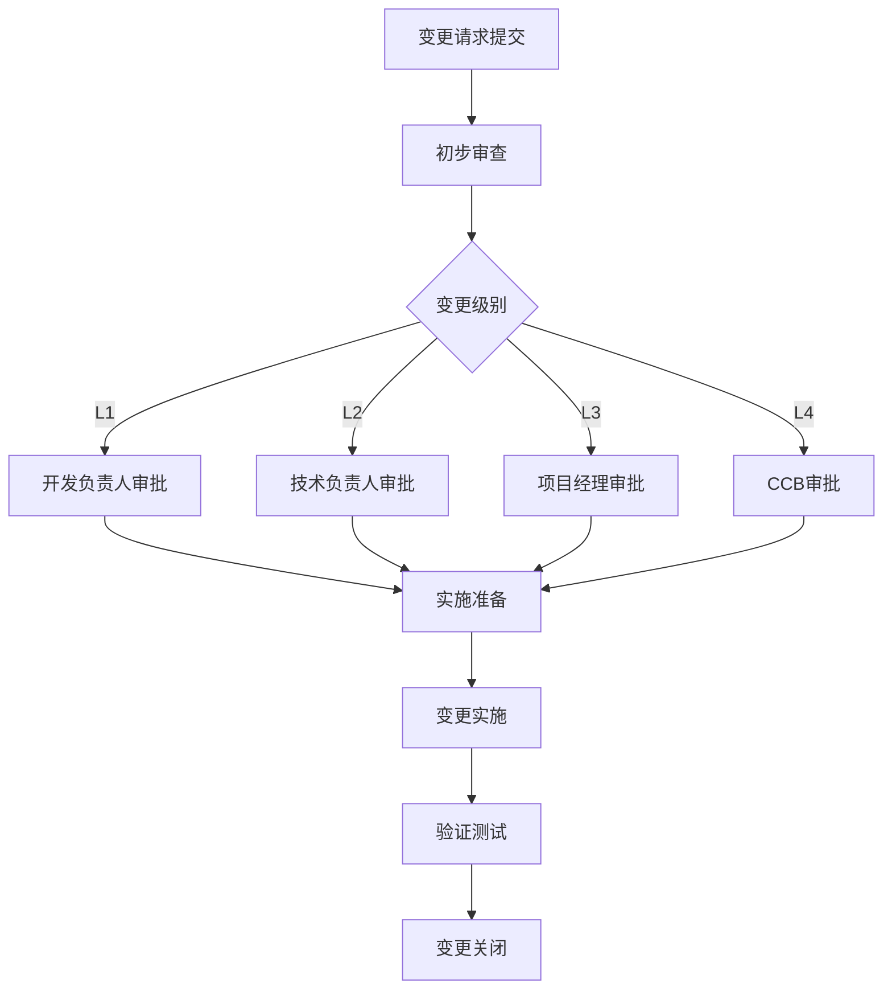

# 变更管理文档

*文档类型：项目管理文档*  
*作者：伍志勇*  
*创建时间：2025年8月29日 10:08:00*  
*最后更新：2025年8月29日 10:08:00*  
*文档版本：v1.0*  
*审核状态：待审核*

---

## 📋 文档信息

| 项目 | 内容 |
|------|------|
| 文档标题 | 变更管理文档 |
| 文档编号 | CM-001 |
| 项目名称 | HKT_SZR_RAG 智能问答系统 |
| 管理版本 | v1.0 |
| 文档状态 | 草稿/评审中/已批准 |

## 📝 修改记录

| 版本 | 日期 | 修改人 | 修改内容 | 审核人 |
|------|------|--------|----------|--------|
| v1.0 | 2025-08-29 | 伍志勇 | 初始版本创建 | 待定 |

## 🎯 专业词汇表

| 术语 | 英文 | 定义 |
|------|------|------|
| CCB | Change Control Board | 变更控制委员会 |
| CR | Change Request | 变更请求 |
| Impact Analysis | Impact Analysis | 影响分析 |
| Baseline | Baseline | 基线 |
| Configuration | Configuration Management | 配置管理 |

---

## 1. 变更管理概述

### 1.1 变更管理目的
<!-- 说明变更管理的目的和重要性 -->

### 1.2 变更管理原则
<!-- 变更管理遵循的基本原则 -->
- **可控性原则**：所有变更必须经过正式流程
- **可追溯原则**：变更过程和结果可追溯
- **影响评估原则**：充分评估变更影响
- **授权批准原则**：变更需要适当级别的授权

### 1.3 变更管理范围
<!-- 变更管理覆盖的范围和边界 -->

## 2. 变更分类与级别

### 2.1 变更类型分类

#### 2.1.1 按变更性质分类
- **功能变更**：新增、修改、删除功能
- **技术变更**：架构、技术栈、工具变更
- **流程变更**：开发、测试、部署流程变更
- **文档变更**：需求、设计、用户文档变更

#### 2.1.2 按变更紧急程度分类
- **紧急变更**：安全漏洞、生产故障修复
- **标准变更**：常规功能优化和改进
- **计划变更**：预先规划的功能迭代

### 2.2 变更级别定义

| 级别 | 影响范围 | 批准权限 | 处理时限 |
|------|----------|----------|----------|
| L1-轻微 | 单个模块，无外部影响 | 开发负责人 | 1个工作日 |
| L2-一般 | 多个模块，有限影响 | 技术负责人 | 3个工作日 |
| L3-重要 | 系统架构，显著影响 | 项目经理 | 5个工作日 |
| L4-重大 | 整体系统，重大影响 | 变更控制委员会 | 10个工作日 |

## 3. 变更控制流程

### 3.1 变更请求提交
<!-- 变更请求的提交流程和要求 -->

#### 3.1.1 变更请求模板
```markdown
## 变更请求基本信息
- 变更编号：CR-YYYYMMDD-XXX
- 提交人：
- 提交日期：
- 变更类型：
- 变更级别：

## 变更描述
- 变更原因：
- 变更内容：
- 预期效果：

## 影响分析
- 功能影响：
- 性能影响：
- 安全影响：
- 兼容性影响：

## 实施计划
- 实施时间：
- 实施步骤：
- 回滚方案：
```

### 3.2 变更评估流程

#### 3.2.1 技术评估
<!-- 技术可行性和风险评估 -->

#### 3.2.2 业务评估
<!-- 业务价值和影响评估 -->

#### 3.2.3 资源评估
<!-- 人力、时间、成本评估 -->

### 3.3 变更审批流程



### 3.4 变更实施流程

#### 3.4.1 实施准备
<!-- 变更实施前的准备工作 -->

#### 3.4.2 实施执行
<!-- 变更的具体实施步骤 -->

#### 3.4.3 实施验证
<!-- 变更实施后的验证和测试 -->

## 4. 变更控制委员会 (CCB)

### 4.1 CCB组成
<!-- 变更控制委员会的组成人员 -->

| 角色 | 姓名 | 职责 |
|------|------|------|
| 主席 | | 主持CCB会议，最终决策 |
| 项目经理 | | 项目影响评估 |
| 技术负责人 | | 技术可行性评估 |
| 质量负责人 | | 质量风险评估 |
| 业务代表 | | 业务价值评估 |

### 4.2 CCB职责
<!-- CCB的具体职责和权限 -->

### 4.3 CCB会议机制
<!-- CCB会议的召开机制和决策流程 -->

## 5. 变更记录管理

### 5.1 变更日志
<!-- 变更记录的格式和内容要求 -->

| 变更编号 | 提交日期 | 变更类型 | 变更描述 | 状态 | 批准人 | 实施日期 |
|----------|----------|----------|----------|------|--------|----------|
| CR-20250829-001 | 2025-08-29 | 功能变更 | 新增用户认证功能 | 已批准 | 张三 | 2025-09-01 |

### 5.2 变更统计分析
<!-- 变更数据的统计和分析 -->

### 5.3 变更趋势监控
<!-- 变更趋势的监控和预警 -->

## 6. 配置管理集成

### 6.1 基线管理
<!-- 与配置管理的基线管理集成 -->

### 6.2 版本控制
<!-- 与版本控制系统的集成 -->

### 6.3 发布管理
<!-- 与发布管理流程的集成 -->

## 7. 变更风险管理

### 7.1 风险识别
<!-- 变更相关风险的识别 -->

### 7.2 风险评估
<!-- 变更风险的评估方法 -->

### 7.3 风险应对
<!-- 变更风险的应对策略 -->

## 8. 应急变更处理

### 8.1 应急变更定义
<!-- 应急变更的定义和触发条件 -->

### 8.2 应急变更流程
<!-- 应急变更的快速处理流程 -->

### 8.3 事后补充审批
<!-- 应急变更的事后补充审批机制 -->

## 9. 变更培训与沟通

### 9.1 培训计划
<!-- 变更管理相关的培训安排 -->

### 9.2 沟通机制
<!-- 变更信息的沟通和传达 -->

### 9.3 知识分享
<!-- 变更经验的分享和积累 -->

## 10. 变更管理工具

### 10.1 工具选择
<!-- 变更管理使用的工具和平台 -->

### 10.2 工具配置
<!-- 工具的配置和定制 -->

### 10.3 工具集成
<!-- 与其他工具的集成 -->

## 11. 变更管理指标

### 11.1 关键指标
<!-- 变更管理的关键绩效指标 -->
- 变更成功率
- 变更处理时间
- 变更影响范围
- 回滚率

### 11.2 指标监控
<!-- 指标的监控和报告机制 -->

### 11.3 持续改进
<!-- 基于指标的持续改进 -->

## 12. 附录

### 12.1 变更请求模板
<!-- 标准的变更请求模板 -->

### 12.2 影响分析模板
<!-- 变更影响分析模板 -->

### 12.3 相关表单
<!-- 变更管理相关的表单和检查清单 -->

---

**变更状态说明：**
- 📝 已提交：变更请求已提交，等待评估
- 🔍 评估中：正在进行影响分析和可行性评估
- ⏳ 待批准：评估完成，等待审批决策
- ✅ 已批准：变更已获得批准，可以实施
- 🚀 实施中：变更正在实施过程中
- ✅ 已完成：变更实施完成并验证通过
- ❌ 已拒绝：变更请求被拒绝
- 🔄 已回滚：变更实施后回滚

**质量检查点：**
- 变更请求完整性检查
- 影响分析充分性检查
- 实施方案可行性检查
- 回滚方案有效性检查