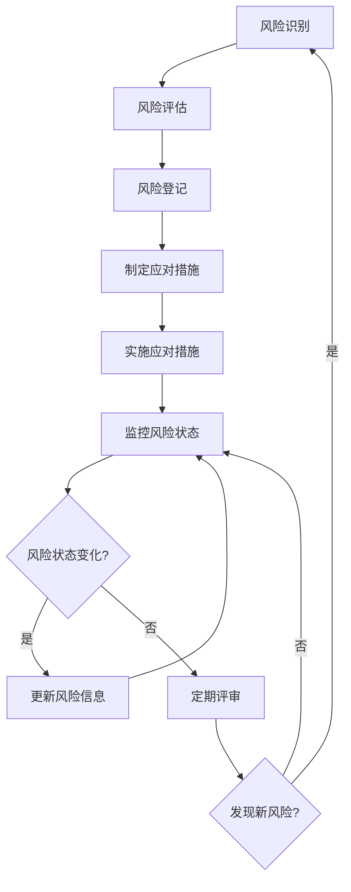
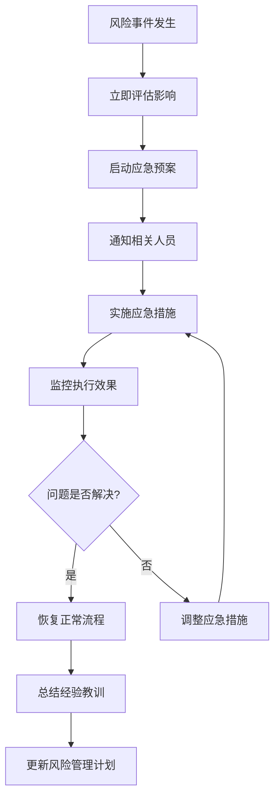

# 风险管理文档

*文档类型：项目管理文档*  
*作者：伍志勇*  
*创建时间：2025年8月29日 10:08:00*  
*最后更新：2025年8月29日 10:08:00*  
*文档版本：v1.0*  
*审核状态：待审核*

---

## 📋 文档信息

| 项目 | 内容 |
|------|------|
| 文档标题 | 风险管理文档 |
| 文档编号 | RM-001 |
| 项目名称 | HKT_SZR_RAG 智能问答系统 |
| 管理版本 | v1.0 |
| 文档状态 | 草稿/评审中/已批准 |

## 📝 修改记录

| 版本 | 日期 | 修改人 | 修改内容 | 审核人 |
|------|------|--------|----------|--------|
| v1.0 | 2025-08-29 | 伍志勇 | 初始版本创建 | 待定 |

## 🎯 专业词汇表

| 术语 | 英文 | 定义 |
|------|------|------|
| Risk | Risk | 可能对项目目标产生负面影响的不确定事件 |
| Probability | Probability | 风险发生的可能性 |
| Impact | Impact | 风险发生时对项目的影响程度 |
| Mitigation | Risk Mitigation | 风险缓解措施 |
| Contingency | Contingency Plan | 应急预案 |

---

## 1. 风险管理概述

### 1.1 风险管理目的
<!-- 说明风险管理的目的和价值 -->

### 1.2 风险管理原则
<!-- 风险管理遵循的基本原则 -->
- **主动识别原则**：主动识别和评估潜在风险
- **全面覆盖原则**：覆盖项目全生命周期的各类风险
- **动态管理原则**：持续监控和更新风险状态
- **分级管理原则**：根据风险等级采取相应措施

### 1.3 风险管理范围
<!-- 风险管理覆盖的范围和边界 -->

## 2. 风险分类体系

### 2.1 按风险来源分类

#### 2.1.1 技术风险
- **技术选型风险**：技术方案不成熟或不适合
- **技术实现风险**：技术实现难度超出预期
- **技术变更风险**：技术标准或工具变更
- **集成风险**：系统集成复杂度和兼容性问题

#### 2.1.2 业务风险
- **需求变更风险**：业务需求频繁变更
- **业务理解风险**：对业务需求理解偏差
- **用户接受风险**：用户对系统接受度不高
- **市场风险**：市场环境和竞争态势变化

#### 2.1.3 管理风险
- **人员风险**：关键人员离职或能力不足
- **沟通风险**：项目沟通不畅或信息传递错误
- **进度风险**：项目进度延迟或里程碑无法达成
- **质量风险**：产品质量不符合预期标准

#### 2.1.4 外部风险
- **供应商风险**：第三方服务或产品问题
- **法规风险**：相关法律法规变化
- **环境风险**：外部环境变化影响项目
- **不可抗力风险**：自然灾害等不可控因素

### 2.2 按风险影响分类

#### 2.2.1 进度影响
- 轻微延迟（1-2周）
- 中等延迟（1-2个月）
- 严重延迟（3个月以上）

#### 2.2.2 成本影响
- 轻微超支（<10%）
- 中等超支（10-30%）
- 严重超支（>30%）

#### 2.2.3 质量影响
- 功能缺陷
- 性能问题
- 安全漏洞

## 3. 风险评估方法

### 3.1 风险概率评估

| 概率等级 | 描述 | 数值范围 | 说明 |
|----------|------|----------|------|
| 很低 | Very Low | 0-10% | 几乎不可能发生 |
| 低 | Low | 11-30% | 不太可能发生 |
| 中 | Medium | 31-60% | 可能发生 |
| 高 | High | 61-80% | 很可能发生 |
| 很高 | Very High | 81-100% | 几乎肯定发生 |

### 3.2 风险影响评估

| 影响等级 | 描述 | 进度影响 | 成本影响 | 质量影响 |
|----------|------|----------|----------|----------|
| 很低 | Very Low | <1周 | <5% | 轻微缺陷 |
| 低 | Low | 1-2周 | 5-10% | 一般缺陷 |
| 中 | Medium | 2-4周 | 10-20% | 重要缺陷 |
| 高 | High | 1-2个月 | 20-40% | 严重缺陷 |
| 很高 | Very High | >2个月 | >40% | 致命缺陷 |

### 3.3 风险等级矩阵

| 概率\影响 | 很低 | 低 | 中 | 高 | 很高 |
|-----------|------|----|----|----| ---- |
| **很高** | 中 | 高 | 高 | 极高 | 极高 |
| **高** | 低 | 中 | 高 | 高 | 极高 |
| **中** | 低 | 低 | 中 | 中 | 高 |
| **低** | 很低 | 低 | 低 | 中 | 中 |
| **很低** | 很低 | 很低 | 低 | 低 | 中 |

## 4. 风险识别清单

### 4.1 技术风险清单

| 风险ID | 风险描述 | 风险类别 | 概率 | 影响 | 风险等级 |
|--------|----------|----------|------|------|----------|
| TR-001 | LoRA微调技术实现复杂度超预期 | 技术实现 | 中 | 高 | 高 |
| TR-002 | 大模型推理性能不满足要求 | 技术性能 | 低 | 高 | 中 |
| TR-003 | 向量数据库扩展性问题 | 技术架构 | 低 | 中 | 低 |
| TR-004 | 第三方API服务不稳定 | 技术依赖 | 中 | 中 | 中 |

### 4.2 业务风险清单

| 风险ID | 风险描述 | 风险类别 | 概率 | 影响 | 风险等级 |
|--------|----------|----------|------|------|----------|
| BR-001 | 用户需求理解偏差 | 需求理解 | 中 | 高 | 高 |
| BR-002 | 业务流程变更频繁 | 需求变更 | 高 | 中 | 高 |
| BR-003 | 用户接受度不高 | 用户接受 | 低 | 高 | 中 |
| BR-004 | 竞争对手推出类似产品 | 市场竞争 | 中 | 中 | 中 |

### 4.3 管理风险清单

| 风险ID | 风险描述 | 风险类别 | 概率 | 影响 | 风险等级 |
|--------|----------|----------|------|------|----------|
| MR-001 | 关键开发人员离职 | 人员风险 | 低 | 很高 | 中 |
| MR-002 | 项目沟通不畅 | 沟通风险 | 中 | 中 | 中 |
| MR-003 | 测试资源不足 | 资源风险 | 中 | 高 | 高 |
| MR-004 | 项目进度延迟 | 进度风险 | 中 | 高 | 高 |

## 5. 风险应对策略

### 5.1 风险应对类型

#### 5.1.1 风险规避 (Avoid)
- **定义**：改变项目计划以完全消除风险
- **适用场景**：高概率、高影响的风险
- **示例**：选择成熟稳定的技术方案

#### 5.1.2 风险缓解 (Mitigate)
- **定义**：降低风险发生的概率或影响
- **适用场景**：中高等级的风险
- **示例**：增加测试覆盖率，提前进行技术验证

#### 5.1.3 风险转移 (Transfer)
- **定义**：将风险转移给第三方承担
- **适用场景**：外部依赖相关的风险
- **示例**：购买保险，签署SLA协议

#### 5.1.4 风险接受 (Accept)
- **定义**：接受风险的存在，制定应急计划
- **适用场景**：低等级风险或无法有效应对的风险
- **示例**：为低概率风险准备应急预案

### 5.2 具体应对措施

#### 5.2.1 技术风险应对

| 风险ID | 应对策略 | 具体措施 | 负责人 | 完成时间 |
|--------|----------|----------|--------|----------|
| TR-001 | 缓解 | 1. 技术预研和原型验证 2. 寻找备选技术方案 3. 增加技术专家支持 | 技术负责人 | 项目启动后1周 |
| TR-002 | 缓解 | 1. 性能基准测试 2. 优化算法和模型 3. 硬件资源升级 | 开发团队 | 开发阶段 |

#### 5.2.2 业务风险应对

| 风险ID | 应对策略 | 具体措施 | 负责人 | 完成时间 |
|--------|----------|----------|--------|----------|
| BR-001 | 缓解 | 1. 深入业务调研 2. 原型验证 3. 定期需求评审 | 产品经理 | 需求阶段 |
| BR-002 | 接受 | 1. 敏捷开发模式 2. 变更管理流程 3. 预留缓冲时间 | 项目经理 | 整个项目周期 |

## 6. 风险监控机制

### 6.1 风险监控指标

#### 6.1.1 风险数量指标
- 新识别风险数量
- 已关闭风险数量
- 活跃风险数量
- 风险等级分布

#### 6.1.2 风险趋势指标
- 风险等级变化趋势
- 风险发生率
- 风险应对有效性
- 风险预警及时性

### 6.2 风险监控流程

### 6.3 风险报告机制

#### 6.3.1 风险状态报告
- **频率**：每周
- **内容**：风险状态更新、新增风险、关闭风险
- **受众**：项目团队

#### 6.3.2 风险管理报告
- **频率**：每月
- **内容**：风险趋势分析、应对措施效果、改进建议
- **受众**：项目干系人

## 7. 应急预案

### 7.1 关键风险应急预案

#### 7.1.1 关键人员离职应急预案
**触发条件**：核心开发人员提出离职
**应急措施**：
1. 立即启动知识转移流程
2. 安排其他人员接手工作
3. 必要时外部招聘或外包
4. 调整项目计划和里程碑

#### 7.1.2 技术方案失败应急预案
**触发条件**：主要技术方案无法实现预期效果
**应急措施**：
1. 启用备选技术方案
2. 重新评估项目范围和目标
3. 调整开发计划和资源分配
4. 与干系人沟通影响和调整

### 7.2 应急响应流程

## 8. 风险管理工具

### 8.1 风险登记册
<!-- 风险信息的集中管理工具 -->

### 8.2 风险评估工具
<!-- 风险评估的辅助工具和模板 -->

### 8.3 风险监控仪表板
<!-- 风险状态的可视化监控工具 -->

## 9. 风险管理培训

### 9.1 培训内容
<!-- 风险管理相关的培训内容 -->

### 9.2 培训计划
<!-- 培训的时间安排和参与人员 -->

### 9.3 培训效果评估
<!-- 培训效果的评估和改进 -->

## 10. 持续改进

### 10.1 风险管理评估
<!-- 定期评估风险管理的有效性 -->

### 10.2 经验教训总结
<!-- 项目风险管理的经验教训 -->

### 10.3 最佳实践积累
<!-- 风险管理最佳实践的积累和分享 -->

## 11. 附录

### 11.1 风险登记册模板
<!-- 标准的风险登记册模板 -->

### 11.2 风险评估表单
<!-- 风险评估的标准表单 -->

### 11.3 应急预案模板
<!-- 应急预案的标准模板 -->

---

**风险状态说明：**
- 🆕 新识别：新发现的风险，需要评估和制定应对措施
- 📊 已评估：完成风险评估，明确概率和影响
- 🎯 应对中：正在实施风险应对措施
- 👁️ 监控中：风险处于监控状态，定期检查
- ✅ 已关闭：风险已消除或不再适用
- 🚨 已发生：风险事件已发生，启动应急预案

**风险管理成熟度：**
- Level 1：被动响应，事后处理
- Level 2：主动识别，定期评估
- Level 3：系统管理，持续监控
- Level 4：预测分析，主动预防
- Level 5：持续优化，最佳实践