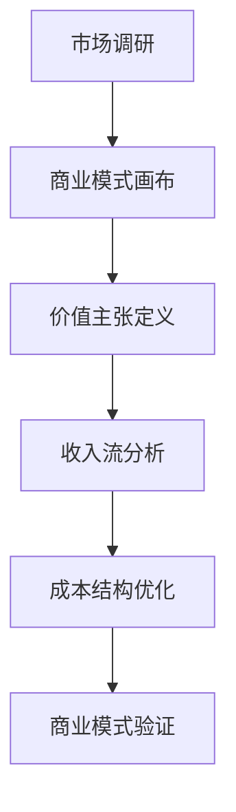
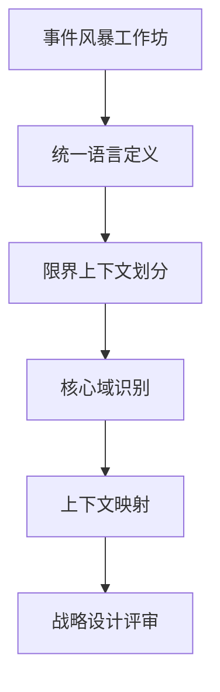
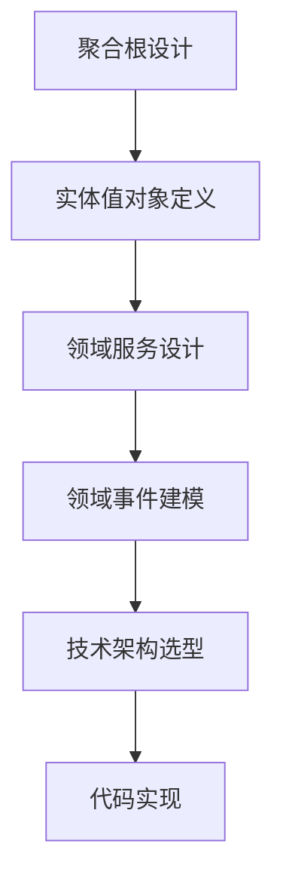
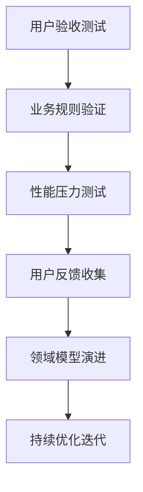

# 商业模式规划到DDD战略规划团队组织架构与工作流程

## 一、背景和动机

随着企业数字化转型的深入，需要建立系统化的方法将商业模式转化为可执行的技术架构。DDD（领域驱动设计）方法提供了从业务概念到技术实现的桥梁，但需要跨职能团队的紧密协作。

## 二、关键挑战和分析

1. **业务-技术鸿沟**：业务团队和技术团队语言不一致，理解偏差
2. **跨部门协作**：需要产品、业务、技术等多部门协同工作
3. **迭代演进**：商业模式和领域模型都需要持续演进和优化
4. **质量保证**：确保技术实现精准匹配商业需求

## 三、高层任务拆分

### 阶段一：商业模式分析与规划（1-2周）
- [ ] 商业模式画布创建与验证
- [ ] 核心业务能力识别
- [ ] 价值流分析映射

### 阶段二：领域战略设计（2-3周）
- [ ] 限界上下文划分
- [ ] 核心领域识别
- [ ] 上下文映射图创建

### 阶段三：战术设计与实施（3-4周）
- [ ] 聚合根设计
- [ ] 领域服务定义
- [ ] 技术架构选型

### 阶段四：验证与迭代（持续）
- [ ] 用户验收测试
- [ ] 领域模型演进
- [ ] 持续优化改进

## 四、工作岗位职责说明

### 1. 业务架构师
**核心职责**：
- 负责商业模式分析和业务能力建模
- 识别核心业务领域和价值流
- 定义业务术语和统一语言
- 协调业务需求和技术实现

**技能要求**：
- 商业模式画布、价值链分析
- 业务流程建模（BPMN）
- 领域驱动设计基础知识
- 出色的沟通和协调能力

### 2. 领域专家（业务代表）
**核心职责**：
- 提供业务领域的专业知识和经验
- 验证领域模型的业务正确性
- 参与统一语言的制定和维护
- 代表业务方参与需求评审

**技能要求**：
- 深厚的业务领域知识
- 能够清晰表达业务需求
- 理解技术实现的基本概念

### 3. DDD架构师
**核心职责**：
- 领导领域战略设计和战术设计
- 划分限界上下文和定义聚合根
- 设计领域事件和领域服务
- 确保技术架构支持领域模型

**技能要求**：
- 精通的DDD理论和实践
- 微服务架构设计经验
- 事件驱动架构知识
- 多种技术栈的架构能力

### 4. 开发团队负责人
**核心职责**：
- 将领域模型转化为代码实现
- 领导开发团队实施DDD模式
- 确保代码质量和技术债务控制
- 协调跨团队的技术协作

**技能要求**：
- 扎实的编程能力（Java/.NET等）
- DDD模式的实际编码经验
- 敏捷开发方法实践
- 代码重构和优化技能

### 5. 产品经理
**核心职责**：
- 管理产品 backlog 和优先级
- 协调业务需求和技术实现
- 确保产品方向与商业模式一致
- 组织用户验收和反馈收集

**技能要求**：
- 产品管理和规划能力
- 用户需求分析和优先级排序
- 跨部门沟通和协调
- 市场分析和竞争分析

### 6. 质量保障工程师
**核心职责**：
- 设计基于领域模型的测试用例
- 确保业务规则的正确实现
- 自动化测试框架的建设和维护
- 性能和安全测试

**技能要求**：
- 测试策略和方法论
- 自动化测试工具使用
- 领域模型理解能力
- 性能测试和分析

## 五、工作流程安排

### 阶段工作流程

#### 1. 商业模式规划阶段

#### 2. 领域战略设计阶段

#### 3. 战术设计与实施阶段

#### 4. 验证迭代阶段

### 日常协作流程

**晨会（每日15分钟）**：
- 各角色汇报进展和问题
- 协调当日重点工作
- 识别阻塞和依赖

**周例会（每周1小时）**：
- 阶段成果评审
- 下一周计划制定
- 跨团队协调

**工作坊（按需召开）**：
- 事件风暴工作坊
- 领域模型评审
- 架构设计评审

## 六、项目状态看板

### 当前阶段：商业模式规划
- [x] 组建跨职能团队
- [x] 明确项目目标和范围
- [ ] 完成商业模式画布
- [ ] 识别核心业务能力
- [ ] 价值流分析完成

### 待办任务
- [ ] 召开事件风暴工作坊
- [ ] 定义统一语言词典
- [ ] 划分限界上下文
- [ ] 设计核心聚合根

### 已完成
- [x] 团队组建和角色分配
- [x] 项目启动和目标确认

## 七、执行者反馈或请求帮助

**当前进展**：已完成团队组建和项目启动，正在进入商业模式分析阶段。

**需要协助**：需要业务部门提供更详细的市场调研数据和客户需求信息，以完善商业模式画布。

**风险提示**：业务团队和技术团队对某些术语的理解存在差异，需要尽快建立统一语言。

## 八、经验教训

1. **统一语言的重要性**：在项目启动初期就建立业务术语表，避免后续沟通误解
2. **跨职能协作**：定期组织业务和技术团队的工作坊，促进相互理解
3. **迭代演进**：领域模型不是一次性的，需要根据业务变化持续优化
4. **工具支持**：使用合适的建模工具（如Miro、Lucidchart）支持远程协作

## 九、成功标准

1. **业务价值实现**：技术方案精准支持商业模式需求
2. **交付质量**：系统功能满足业务规则，性能达标
3. **团队协作**：跨职能团队协作顺畅，沟通效率高
4. **迭代能力**：具备快速响应业务变化的技术架构

## 十、具体业务领域案例：中小企业服务平台

### 案例背景
某科技公司计划开发面向中小企业的综合服务平台，提供财税管理、人力资源、法务咨询、营销推广等一站式服务。

### 商业模式分析
**价值主张**：
- 降低中小企业运营成本
- 提供专业级的企业服务
- 简化业务流程数字化
- 智能化决策支持

**客户细分**：
- 初创企业（1-20人）
- 成长型企业（20-100人）
- 传统行业转型企业

**收入来源**：
- SaaS订阅费用
- 增值服务收费
- 交易佣金
- 广告收入

### DDD战略规划实施

#### 限界上下文划分：
1. **企业身份认证上下文**
   - 聚合根：企业实体
   - 核心领域：企业认证、资质管理
   - 支撑领域：第三方认证服务集成

2. **财税服务上下文**
   - 聚合根：账套实体
   - 核心领域：记账、报税、发票管理
   - 通用领域：税务规则引擎

3. **人力资源上下文**
   - 聚合根：员工实体
   - 核心领域：考勤、薪酬、社保
   - 支撑领域：政策法规服务

4. **法务咨询上下文**
   - 聚合根：合同实体
   - 核心领域：合同管理、法务咨询
   - 通用领域：法律知识库

5. **营销推广上下文**
   - 聚合根：营销活动实体
   - 核心领域：客户管理、营销活动
   - 支撑领域：第三方营销平台集成

#### 领域事件设计：
- `企业注册完成事件` → 触发欢迎邮件和初始配置
- `发票上传事件` → 触发自动记账和税务计算
- `员工入职事件` → 触发社保开户和系统账号创建
- `合同签署事件` → 触发法务审核和归档流程
- `营销活动创建事件` → 触发客户群体分析和推送

#### 实施成效：
- **开发效率**：模块化设计使并行开发成为可能，缩短上市时间30%
- **业务灵活性**：各上下文独立演进，快速响应政策变化和客户需求
- **系统稳定性**：领域边界清晰，故障隔离，系统可用性达到99.9%
- **客户满意度**：精准的业务建模带来更好的用户体验，NPS评分+25

### 经验总结
1. **领域识别关键**：准确识别核心领域（财税、人力）和支撑领域（认证、集成）
2. **事件驱动架构**：通过领域事件实现业务流程自动化
3. **统一语言建立**：业务和技术团队共同定义"账套"、"员工生命周期"等术语
4. **迭代演进**：从最小可行产品开始，逐步扩展服务范围

## 十一、总结

这份组织架构和工作流程设计确保了从商业模式规划到DDD战略规划的全流程覆盖，通过明确的角色职责和协作机制，能够有效调动各个岗位的专长，实现业务价值和技术创新的完美结合。中小企业服务平台案例展示了如何将具体的商业模式需求转化为可执行的DDD架构设计。