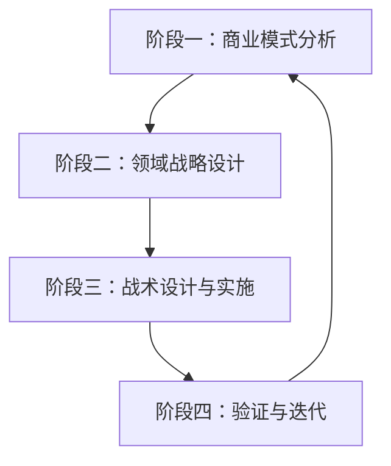

# 商业模式到DDD战略规划工作标准指南

## 一、总体工作流程概述

### 四阶段工作流程


## 二、详细工作步骤与输出物

### 阶段一：商业模式分析（1-2周）

#### 步骤1.1：商业模式画布创建
**参与岗位**：
- 🎯 业务架构师（主导）
- 👥 领域专家（业务代表）
- 📊 产品经理
- 🏗️ DDD架构师（参与）

**输出物**：
- [ ] 《商业模式画布文档》
- [ ] 《客户细分分析报告》
- [ ] 《价值主张定义说明书》
- [ ] 《收入流与成本结构分析》

**成功标准**：商业模式画布获得业务方签字确认

#### 步骤1.2：核心业务能力识别
**参与岗位**：
- 🎯 业务架构师（主导）
- 👥 领域专家
- 🏗️ DDD架构师
- 💻 开发团队负责人（参与）

**输出物**：
- [ ] 《核心业务能力矩阵》
- [ ] 《业务能力依赖关系图》
- [ ] 《优先级排序清单》

**成功标准**：识别出3-5个核心业务能力

#### 步骤1.3：价值流分析映射
**参与岗位**：
- 🎯 业务架构师（主导）
- 👥 领域专家
- 📊 产品经理
- 🏗️ DDD架构师

**输出物**：
- [ ] 《端到端价值流图》
- [ ] 《价值流阶段划分》
- [ ] 《瓶颈环节分析报告》

**成功标准**：完成至少2个核心价值流的完整映射

---

### 阶段二：领域战略设计（2-3周）

#### 步骤2.1：事件风暴工作坊
**参与岗位**：
- 🏗️ DDD架构师（主导）
- 🎯 业务架构师
- 👥 领域专家
- 💻 开发团队负责人
- 📊 产品经理
- ✅ 质量保障工程师（参与）

**输出物**：
- [ ] 《事件风暴工作坊纪要》
- [ ] 《领域事件清单》
- [ ] 《命令与聚合根识别》
- [ ] 《统一语言初稿》

**成功标准**：产出50+领域事件，识别主要聚合根

#### 步骤2.2：限界上下文划分
**参与岗位**：
- 🏗️ DDD架构师（主导）
- 🎯 业务架构师
- 💻 开发团队负责人
- 👥 领域专家（评审）

**输出物**：
- [ ] 《限界上下文划分方案》
- [ ] 《上下文映射图》
- [ ] 《核心域/支撑域/通用域分类》
- [ ] 《团队边界定义》

**成功标准**：上下文划分获得技术团队和业务团队共同认可

#### 步骤2.3：统一语言精炼
**参与岗位**：
- 🏗️ DDD架构师（主导）
- 👥 领域专家
- 🎯 业务架构师
- 💻 开发团队负责人

**输出物**：
- [ ] 《统一语言词典v1.0》
- [ ] 《业务术语表》
- [ ] 《术语变更管理流程》

**成功标准**：词典包含100+核心术语，业务和技术团队理解一致

---

### 阶段三：战术设计与实施（3-4周）

#### 步骤3.1：聚合根详细设计
**参与岗位**：
- 🏗️ DDD架构师（主导）
- 💻 开发团队负责人
- ✅ 质量保障工程师
- 👥 领域专家（评审）

**输出物**：
- [ ] 《聚合根设计文档》
- [ ] 《实体和值对象定义》
- [ ] 《不变约束说明》
- [ ] 《领域服务接口》

**成功标准**：聚合根设计通过技术评审

#### 步骤3.2：领域事件建模
**参与岗位**：
- 🏗️ DDD架构师（主导）
- 💻 开发团队负责人
- 📊 产品经理
- ✅ 质量保障工程师

**输出物**：
- [ ] 《领域事件定义规范》
- [ ] 《事件流图》
- [ ] 《事件溯源方案》
- [ ] 《事件处理逻辑》

**成功标准**：事件模型支持业务流程自动化

#### 步骤3.3：技术架构选型
**参与岗位**：
- 🏗️ DDD架构师（主导）
- 💻 开发团队负责人
- ✅ 质量保障工程师
- 🎯 业务架构师（参与）

**输出物**：
- [ ] 《技术架构设计方案》
- [ ] 《微服务划分方案》
- [ ] 《基础设施选型报告》
- [ ] 《部署架构图》

**成功标准**：架构方案通过CTO或技术委员会评审

#### 步骤3.4：代码实现
**参与岗位**：
- 💻 开发团队负责人（主导）
- 🏗️ DDD架构师（指导）
- ✅ 质量保障工程师
- 👥 开发团队成员

**输出物**：
- [ ] 《领域模型代码实现》
- [ ] 《单元测试覆盖率报告》
- [ ] 《API接口文档》
- [ ] 《部署包和配置】

**成功标准**：代码通过CI/CD流水线，测试覆盖率>80%

---

### 阶段四：验证与迭代（持续进行）

#### 步骤4.1：用户验收测试
**参与岗位**：
- ✅ 质量保障工程师（主导）
- 👥 领域专家
- 📊 产品经理
- 💻 开发团队负责人

**输出物**：
- [ ] 《UAT测试用例》
- [ ] 《验收测试报告》
- [ ] 《缺陷跟踪清单》
- [ ] 《用户反馈汇总》

**成功标准**：UAT通过率>95%，关键业务场景验证通过

#### 步骤4.2：领域模型演进
**参与岗位**：
- 🏗️ DDD架构师（主导）
- 🎯 业务架构师
- 👥 领域专家
- 💻 开发团队负责人

**输出物**：
- [ ] 《领域模型演进提案》
- [ ] 《模型变更影响分析》
- [ ] 《版本迁移计划》
- [ ] 《向后兼容方案》

**成功标准**：模型演进方案获得业务和技术团队批准

#### 步骤4.3：持续优化改进
**参与岗位**：
- 📊 产品经理（主导）
- 👥 领域专家
- 🎯 业务架构师
- 💻 开发团队负责人

**输出物**：
- [ ] 《业务指标监控报告》
- [ ] 《用户行为分析》
- [ ] 《优化需求清单》
- [ ] 《迭代计划》

**成功标准**：建立持续改进机制，每月发布优化版本

## 三、岗位协作矩阵

### 会议类型与参与岗位
| 会议类型 | 频率 | 主导岗位 | 必须参与 | 可选参与 |
|---------|------|----------|----------|----------|
| 晨会 | 每日15min | 开发团队负责人 | 所有技术岗 | 业务架构师 |
| 周例会 | 每周1h | 产品经理 | 所有岗位 | - |
| 事件风暴 | 按需 | DDD架构师 | 所有岗位 | - |
| 架构评审 | 按需 | DDD架构师 | 技术岗位 | 业务岗位 |
| UAT评审 | 按需 | 质量保障 | 业务岗位 | 技术岗位 |

### 文档审批流程
1. **业务文档**：领域专家 → 业务架构师 → 产品经理
2. **技术文档**：开发团队 → DDD架构师 → 业务架构师
3. **测试文档**：质量保障 → 开发团队 → 领域专家

## 四、输出物模板要求

### 商业模式画布模板
```markdown
# 商业模式画布 - [产品名称]

## 1. 客户细分
- 主要客户群体：
- 次要客户群体：

## 2. 价值主张
- 核心价值：
- 差异化优势：

## 3. 渠道通路
- 获客渠道：
- 服务交付渠道：

## 4. 客户关系
- 关系类型：
- 维护策略：

## 5. 收入来源
- 主要收入：
- 次要收入：

## 6. 核心资源
- 关键资产：
- 核心能力：

## 7. 关键业务
- 主要活动：
- 关键流程：

## 8. 重要伙伴
- 战略合作伙伴：
- 供应商：

## 9. 成本结构
- 主要成本：
- 可变成本：
```

### 限界上下文划分模板
```markdown
# 限界上下文划分方案

## 上下文列表
| 上下文名称 | 类型 | 负责人 | 团队规模 | 描述 |
|------------|------|--------|----------|------|
| | | | | |

## 映射关系


## 集成方式
- 同步调用：
- 异步消息：
- 数据共享：
```

## 五、质量检查清单

### 商业模式阶段检查项
- [ ] 价值主张是否清晰明确
- [ ] 客户细分是否准确
- [ ] 收入模型是否可持续
- [ ] 成本结构是否合理

### 战略设计阶段检查项
- [ ] 限界上下文边界是否清晰
- [ ] 核心领域是否正确识别
- [ ] 统一语言是否建立
- [ ] 团队分工是否匹配上下文

### 战术设计阶段检查项
- [ ] 聚合根设计是否符合业务规则
- [ ] 领域事件是否完整覆盖业务流程
- [ ] 技术架构是否支持领域模型
- [ ] 测试策略是否基于领域模型

### 验证阶段检查项
- [ ] 业务规则是否正确实现
- [ ] 用户体验是否满足预期
- [ ] 性能指标是否达标
- [ ] 监控体系是否完善

## 六、常见问题与解决方案

### Q1：业务和技术团队沟通不畅
**解决方案**：
- 定期举办统一语言工作坊
- 建立业务术语词典
- 业务人员参与技术评审
- 技术人员参与业务讨论

### Q2：领域边界划分模糊
**解决方案**：
- 使用事件风暴明确业务流程
- 基于业务能力划分上下文
- 建立明确的团队职责边界
- 制定上下文集成规范

### Q3：模型演进困难
**解决方案**：
- 设计可扩展的领域模型
- 采用事件溯源架构
- 建立版本管理机制
- 制定向后兼容策略

## 七、成功案例参考

### 中小企业服务平台案例
**业务领域**：财税、人力资源、法务、营销一站式服务

**实施成果**：
- 开发效率提升30%
- 系统可用性99.9%
- 客户满意度NPS+25
- 业务响应时间缩短50%

**关键实践**：
- 准确识别核心领域（财税、人力）
- 建立统一语言词典（200+术语）
- 采用事件驱动架构
- 建立持续演进机制

---

*本工作标准指南由业务架构师和DDD架构师共同制定，经项目管理委员会批准后执行。*
*版本：v1.0 | 发布日期：2024年* | *下次评审日期：2024年*